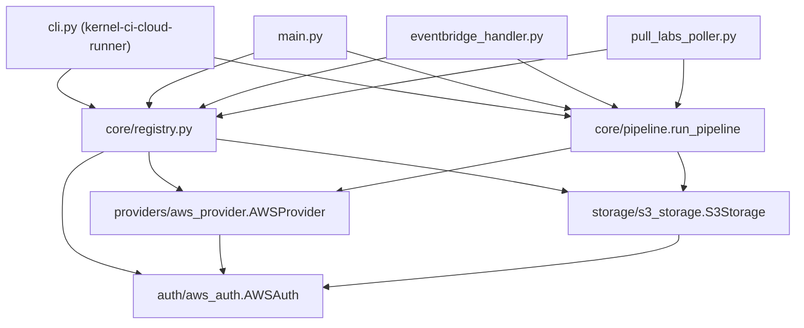
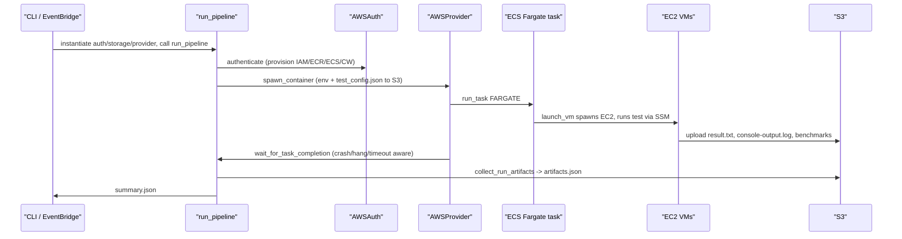

# System Overview & Component Map

`pullab_cloud` (Python package `kernel_ci_cloud_labs`) is a KernelCI "pull lab": it bridges the KernelCI API to ephemeral AWS infrastructure, running kernel boot/benchmark tests on freshly spawned EC2 VMs and reporting results back to KernelCI/KCIDB. Two end-to-end flows drive it: the **direct pipeline run** (CLI / EventBridge) and the **pull-lab poller** flow (kernelci-api -> pipeline -> KCIDB).

## 1. Layered architecture

A small **registry** decouples the orchestration core from concrete cloud backends. Three pluggable abstractions - *provider*, *storage*, *auth* - are registered by decorator and instantiated by name from configuration.



### The registry (`core/registry.py`)

`registry.py` declares three module-level dicts - `PROVIDER_REGISTRY`, `STORAGE_REGISTRY`, `AUTH_REGISTRY` - plus the decorators `register_provider` / `register_storage` / `register_auth` that populate them, and read-side helpers `get_provider` / `get_storage` / `get_auth`. Concrete classes self-register at import time: `AWSProvider` via `@register_provider("aws")`, `S3Storage` via `@register_storage("s3")`, `AWSAuth` via `@register_auth("aws")`.

Since registration only fires when the defining module is imported, every entry point first calls `main.import_all_packages(...)` to walk and import every submodule of `kernel_ci_cloud_labs.providers`, `.storage`, and `.auth` so the decorators run before the registries are read.

## 2. Entry points

There are **four entry-point objects**. Three - the CLI, `main.main()`, and the EventBridge handler - call `run_pipeline` directly; `PullLabsPoller` calls it indirectly through a swappable job executor. All converge on the same registry-based `auth -> storage -> provider -> run_pipeline` sequence. [Chapter 02](02-invocation-control-flow.md) enumerates these as **five invocation modes**, since the poller is reachable three ways (`run_forever`, `--once`, `lambda_handler`).

| Entry point | File | Trigger |
|---|---|---|
| `kernel-ci-cloud-runner` CLI | `cli.py` | Human / shell |
| `main.main()` | `main.py` | Library / direct call |
| `handle_eventbridge` (a.k.a. `lambda_handler`) | `eventbridge_handler.py` | EventBridge / Lambda |
| `PullLabsPoller` | `pull_labs_poller.py` | kernelci-api polling loop |

### CLI (`cli.py`)

`cli.py` builds an `argparse` tree rooted at `kernel-ci-cloud-runner aws ...` with subcommands `run`, `analyze`, and `setup` (`configure`, `upload-rpms`, `upload-tests`, `cleanup`, `validate`). `run` dispatches to `cmd_run`, which:

1. Optionally downloads a config from S3 when `--config-s3` is given (S3 config takes precedence over `--config`, for EventBridge-style triggers).
2. Imports all provider/storage/auth packages so the registries populate.
3. Loads `config.json` and merges in `credentials.json` via `main.load_credentials`.
4. Instantiates the three backends from the registries and calls `run_pipeline`:

```python
auth = AUTH_REGISTRY[config["auth_credentials"]["auth_provider"]](config, credentials)
storage = STORAGE_REGISTRY[config["storage"]["type"]](storage_config, auth)
provider = PROVIDER_REGISTRY[config["provider"]](auth, config, storage)
run_pipeline(provider, storage, run_dir=run_dir)
```

`main.main()` performs the same lookup/instantiation; `eventbridge_handler.handle_eventbridge` repeats it after fetching the config from S3 (Flow B).

## 3. The pipeline (`core/pipeline.run_pipeline`)

`run_pipeline(provider, storage, run_dir=None)` is the provider-agnostic orchestration heart - it only calls methods on the `provider` and `storage` objects handed to it. Key behaviours grounded in the source:

- **Run prefix.** Derives a per-run prefix `run_{test_id}_{run_timestamp}`, where `run_timestamp` is `datetime.now(timezone.utc).strftime("%Y%m%d_%H%M%S")`. This scopes every S3 key and the per-run CloudWatch VM log group, and is written into `provider.config["run_prefix"]`.
- **Boot-log public-read probe.** Before spawning, `_warn_if_logs_not_public` does a read-only bucket-policy check and only *warns* if kernel boot logs would not be publicly reachable by KCIDB dashboard users; it never aborts.
- **Crash-aware wait.** `provider.wait_for_task_completion()` (section 4) blocks until the ECS task stops; a non-zero container exit shortens the subsequent VM-log wait and publishes the container's own log as the failure URL.
- **Artifacts.** After VM logs are pulled, `collect_run_artifacts` downloads each instance's `console-output.log` and writes `artifacts.json` (section 6).
- **Cleanup is unconditional.** A `finally` block stops the ECS task and terminates every EC2 instance tagged `run_prefix=<this run>` still `pending`/`running`.
- **Summary.** `create_summary` parses `vms/<instance_id>.log` files into per-instance PASS/FAIL rows and writes `summary.json`; the `vms.instances` list is the per-VM ground truth later joined against `artifacts.json` by the poller.

## 4. AWS provider (`providers/aws_provider.AWSProvider`)

`AWSProvider` runs a single launcher container on **AWS Fargate** and waits for it to finish, with kernel-crash detection layered on plain status polling.

### `spawn_container`

Builds ECS `containerOverrides` environment variables and uploads the test config to S3. The container environment:

| Env var | Source |
|---|---|
| `RUN_PREFIX` | `config["run_prefix"]` |
| `S3_BUCKET` | `storage.bucket` |
| `AWS_REGION` | `config["region"]` |
| `EC2_LOG_GROUP` | first `cloudwatch.log_groups` key containing `/ec2/` |
| `KCI_DEBUG` | host env `KCI_DEBUG` (only if set) |
| `TEST_CONFIG_FILENAME` | always `"test_config.json"` |

The full `config["test_config"]` is serialised to JSON and uploaded to `{run_prefix}/test_config.json`; only the bare filename is passed in `TEST_CONFIG_FILENAME`, and the container rebuilds the full path from `RUN_PREFIX` + filename. The task launches with `ecs.run_task(..., launchType="FARGATE", enableExecuteCommand=True, ...)`, with up to 5 retries for transient (IAM-propagation) errors.

### `wait_for_task_completion`

Polls task status until `STOPPED` while tailing the per-run VM console log group `{EC2_LOG_GROUP}/{run_prefix}` for kernel crash/stall patterns. It aborts early - stopping the task and raising `RuntimeError` - on:

- a kernel-side crash/stall pattern (panic, Oops:, BUG:, soft lockup, RCU stall, hung task, GP fault, paging fault);
- no new console output for `PULLAB_TASK_HANG_THRESHOLD_SEC` seconds (default **600**);
- overall `PULLAB_TASK_WAIT_TIMEOUT_SEC` seconds elapsed (default **3600**).

Poll interval is `PULLAB_TASK_POLL_INTERVAL_SEC` (default **30**); a progress line logs every `PULLAB_TASK_PROGRESS_LOG_SEC` (default 120). Crash detection is disabled (falling back to pure status polling) when no `/ec2/` log group or no `run_prefix` is configured.

## 5. In-container launcher and VM client

### Container image (`dockerfiles/aws/test.dockerfile`)

Image is `python:3.12-slim`, installs **only** `boto3`, and copies `launch_vm.py`, `debug_aws_setup.py`, the package `__init__.py` stubs, and `core/log_scrub.py` (so `launch_vm.py`'s `from kernel_ci_cloud_labs.core.log_scrub import scrub_text` resolves). `CMD` runs `debug_aws_setup.py` (ignoring its exit code) then `launch_vm.py`.

### `launch_vm.py`

`launch_vms_from_config()` is the container entrypoint. It reads `RUN_PREFIX`, `S3_BUCKET`, `AWS_REGION`, `TEST_CONFIG_FILENAME` from the environment, loads the test config from S3 at `{run_prefix}/{config_filename}`, expands the `vms` array (one VM per test, `min_count` instances each), and launches each in its own thread. Per VM, `launch_and_test_vm`:

1. Spawns an EC2 instance (`VMLauncher.spawn_vm`) tagged `run_prefix=<run_prefix>`.
2. Runs the test via SSM (`execute_test_via_ssm`).
3. **Always** calls `check_test_result` to read `result.txt` from S3 as the source of truth, even if SSM reported `Failed` - short-lived VMs often shut down before SSM reports final status.
4. In `finally`, runs `cleanup`, which captures the EC2 serial console (scrubbed for secrets) and uploads it to `{run_prefix}/test_{test}/output/{instance_id}/console-output.log`.

`execute_test_via_ssm` sets the SSM command timeout to `min(max_runtime + 3600, 43200)` (max 12h) and directs SSM Run Command output to CloudWatch log group `{ec2_log_group}/{run_prefix}`.

### `test-vm-client.sh`

The client script SSM downloads and runs inside each VM:

- Finds and runs `run*.sh` stages **sorted with `sort -V`**, executing exactly one stage per `RUN_ID` (persisted per-instance in S3 and incremented each invocation).
- Uses **exit code 194** to signal the SSM agent to reboot the VM and re-run for the next stage; the final stage exits with the script's own code and triggers a delayed shutdown.
- On the final stage, uploads `result.txt`, `stats.json`, and every `benchmark-*.csv` (and `results_*`) to `{run_prefix}/test_{test}/output/{instance_id}/`. On a mid-chain failure it writes a `FAILED` `result.txt`/`stats.json` and stops the chain.

## 6. Results & artifacts

`core/artifacts.collect_run_artifacts` discovers each `(test, instance_id)` pair under the run prefix, downloads `console-output.log` into `run_dir/vms/<instance_id>-console.log`, and writes an `artifacts.json` manifest with sha256/size/content-type plus the S3 URI and a public HTTPS `log_url`. The URL is built by `s3_public_url`, forming `https://<bucket>.s3.<region>.amazonaws.com/<key>`; it only resolves when the bucket carries the public-read boot-log policy.

`storage/s3_storage.S3Storage` provides the S3 backend. `upload_tests` and `upload_test_payload` MD5-compare the local artifact's hash against the existing S3 object's ETag to skip redundant uploads. Separately, `copy_external_requirements` copies each *enabled* folder listed in a test's `external_requirements.json` from the `external_storage` bucket into `{run_prefix}/shared/{folder}/` via server-side S3 `copy_object`, skipping a folder that already exists there - an S3 folder-existence check (`_check_s3_folder_exists`), **not** an MD5 comparison.

## 7. Authentication & resource provisioning (`auth/aws_auth.AWSAuth`)

`AWSAuth.authenticate()` is more than a credential check: when the corresponding config sections are present, the *same* call provisions the full AWS footprint the pipeline needs:

- IAM roles via `AWSRoleManager.ensure_exists` (honouring `force_recreate_roles`);
- the ECR repository, and if a `docker` section is present, builds and pushes the Docker image;
- the ECS cluster;
- CloudWatch log groups;
- the ECS task definition.

It tracks whether any resource was newly created (`_resources_created`) so the pipeline can wait for AWS propagation before spawning.

## 8. Flow A - CLI / EventBridge direct run



`eventbridge_handler.handle_eventbridge` downloads the config from `config_s3_uri`, calls `_prepare_kernel_rpms` (a placeholder that currently just expects pre-uploaded RPMs), makes the config run-local by appending a unique suffix to `test_config.test_id`, then runs the standard `run_pipeline` via the registry instantiation.

## 9. Flow B - Pull-lab poller (`pull_labs_poller.PullLabsPoller`)

- **Polling/matching.** `poll_once` issues `GET /events?state=available&kind=job` and matches runtime + platform.
- **Claiming.** `_claim_node` records `data.job_id` on the node and **leaves the state `available`**. kernelci-api's state machine forbids `available -> running`, and `available -> closing` would be auto-finished (~60s, no result) by kernelci-pipeline's timeout handler - so `data.job_id` is the only viable claim marker.
- **Translation.** `translate_job` (in `pull_labs_translate.py`) raises `ValueError` if `artifacts.kernel` or `artifacts.modules` is missing, produces exactly one `vms[*]` entry, derives `test_id = pulllab-<arch>-<short_id>`, and passes `KERNEL_URL` / `MODULES_URL` / `ARCH` (plus optional `ROOTFS_URL`, `KERNELCI_NODE_ID`) as `test_params`.
- **Execution.** `_default_job_executor` uses the same registry-based instantiation as `main.py`, calls `run_pipeline`, and post-processes via `_extract_test_results`.
- **Build ID.** `resolve_build_id` walks `node.parent` up to **8** hops to a `kbuild` ancestor and returns `origin:<node_id>`.
- **KCIDB reporting.** Direct KCIDB submission from the poller is **currently disabled** (the `submit_tests` call is commented out). Instead the boot-log URL is written onto the maestro node's `artifacts.test_log` so kernelci-pipeline's `send_kcidb` emits the single dashboard-visible row. The row-building code (and `_node_result_from_rows`) is kept so outcome derivation still works and dual submission can be re-enabled cheaply.

`kcidb_submit.build_test_row` validates `origin` against `[a-z0-9_]+` and `path` against the KCIDB v5.3 dot-segment grammar, raising `ValueError` on invalid values; `KCIDB_SCHEMA_VERSION` is `{"major": 5, "minor": 3}`.

## 10. Configuration (`examples/aws/config.json`)

The example config's `kernelci` section sets `runtime_name = "pull-labs-aws-ec2"`, `platforms = ["aws-ec2-x86_64"]`, and `kcidb_origin = "pullab_cloud_aws"`, with both `api_token` and `kcidb_jwt` left `null` in the file - these are injected at runtime via the `KERNELCI_API_TOKEN` / `KCIDB_JWT` env vars (or `UNIFIED_TOKEN` as a shared fallback). The `platforms` filter narrows the shared `pull-labs-aws-ec2` runtime to x86_64 jobs.

## Component reference

| Component | File | Role |
|---|---|---|
| CLI | `cli.py` | Argparse entry point; `cmd_run` instantiates backends and runs the pipeline |
| Library main | `main.py` | `import_all_packages` + registry instantiation + `run_pipeline` |
| Registry | `core/registry.py` | `PROVIDER`/`STORAGE`/`AUTH_REGISTRY` + `register_*` decorators |
| Pipeline | `core/pipeline.py` | `run_pipeline` orchestration, summary, cleanup |
| AWS provider | `providers/aws_provider.py` | Fargate `run_task`, crash-aware completion wait |
| AWS auth | `auth/aws_auth.py` | Credentials + IAM/ECR/ECS/CloudWatch provisioning |
| S3 storage | `storage/s3_storage.py` | Test/payload upload, shared external requirements |
| Launcher | `launch_vm.py` | In-container EC2 spawn + SSM test execution |
| VM client | `vm-tests/test-vm-client.sh` | Staged `run*.sh` execution with reboot via exit 194 |
| Artifacts | `core/artifacts.py` | `collect_run_artifacts`, `artifacts.json`, public log URLs |
| EventBridge | `eventbridge_handler.py` | Lambda-compatible scheduled trigger |
| Poller | `pull_labs_poller.py` | kernelci-api <-> pipeline <-> KCIDB bridge |
| Translate | `pull_labs_translate.py` | PULL_LABS job_definition -> run config |
| KCIDB submit | `kcidb_submit.py` | KCIDB v5.3 row/revision build + REST submit |
