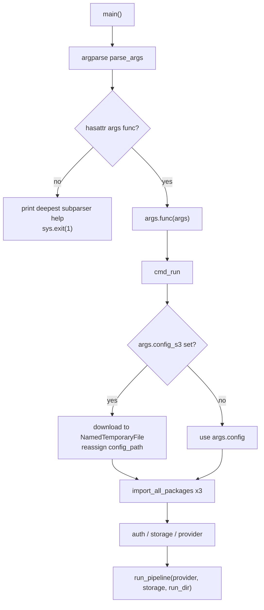
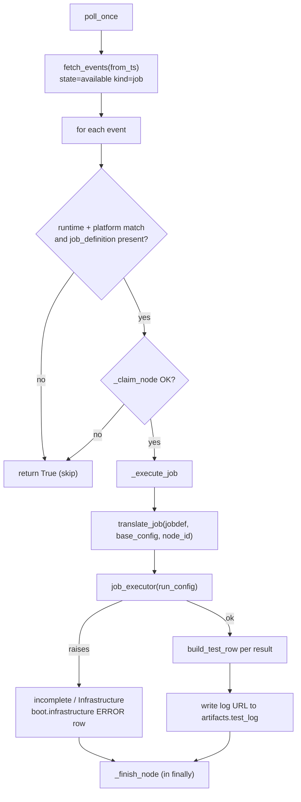

# Invocation & Control Flow (5 entry modes)

`pullab_cloud` (Python package `kernel_ci_cloud_labs`) has five entry points. All converge on the same registry-driven pattern (build `auth` -> `storage` -> `provider`, then `run_pipeline`), but differ in who triggers them, where config comes from, and what wraps the pipeline call.

| # | Entry mode | Source symbol | Trigger |
|---|------------|---------------|---------|
| 1 | CLI subcommand | `kernel_ci_cloud_labs.cli:main` | Operator running `kernel-ci-cloud-runner aws run ...` |
| 2 | Library `main()` | `kernel_ci_cloud_labs.main:main` | `python -m`/import; default `config_path="examples/aws/config.json"` |
| 3 | EventBridge / Lambda (one-shot pipeline) | `kernel_ci_cloud_labs.eventbridge_handler.lambda_handler` | EventBridge scheduled rule / custom event |
| 4 | Pull-lab poller (CLI / long-running loop) | `kernel_ci_cloud_labs.pull_labs_poller:main` | Container loop or cron with `--once` |
| 5 | Pull-lab poller (Lambda) | `kernel_ci_cloud_labs.pull_labs_poller.lambda_handler` | Lambda, single poll cycle per invocation |

Modes 1-3 directly run one pipeline. Modes 4-5 poll `kernelci-api` for pull-lab jobs and invoke the pipeline indirectly through a pluggable *job executor*.

---

## The shared core: registry instantiation

Four of the five modes build the same trio from the registries in `kernel_ci_cloud_labs.core.registry`, keyed off the config dict:

- `AUTH_REGISTRY[config["auth_credentials"]["auth_provider"]]`
- `STORAGE_REGISTRY[config["storage"]["type"]]`
- `PROVIDER_REGISTRY[config["provider"]]`

To populate the registries, every submodule of `providers`, `storage`, and `auth` must be imported first so the `register_*` decorators run. `import_all_packages` (`main.py`) does this via `importlib.import_module` plus `pkgutil.iter_modules` walking `package.__path__`.

The storage object is always built from a *merged* config - `config["storage"]` plus root-level `region` and `external_storage` - and this exact merge is duplicated in all four call sites (`cli.py`, `main.py`, `eventbridge_handler.py`, `pull_labs_poller.py`):

```python
storage_config = {
    **config["storage"],
    "region": config.get("region"),
    "external_storage": config.get("external_storage", {}),
}
```

`run_pipeline` lives in `core/pipeline.py` with signature `run_pipeline(provider, storage, run_dir=None)` and returns the summary dict. The generated run prefix has the format `run_{test_id}_{datetime}`, and per-instance VM console logs land at the S3 key `{run_prefix}/test_{test}/output/{instance_id}/console-output.log` (`launch_vm.py`).

---

## Mode 1 - CLI subcommand (`cli.py`)

The console-script `kernel-ci-cloud-runner` is bound to `kernel_ci_cloud_labs.cli:main` (`setup.py`). `main()` builds a nested argparse tree (`cloud` -> `command` -> `setup_command`) and dispatches via `args.func(args)`. When no `func` is bound (incomplete subcommand), it prints help for the *deepest subparser reached* and exits code `1`: `setup` help when `cloud==aws and command==setup`, otherwise the `aws` parser help, otherwise the top-level parser help.

The pipeline-running subcommand `aws run` is handled by `cmd_run`. Control flow:

1. Set up logging into a fresh run directory.
2. Resolve config path: `config_path = args.config` by default, but **if `args.config_s3` is set, config is downloaded from S3 to a `NamedTemporaryFile(delete=False)` and `config_path` is reassigned** - so `--config-s3` takes precedence over `--config` (used for EventBridge-style triggers passing config in S3).
3. `import_all_packages` runs for `providers`, `storage`, `auth` *before* config load and registry lookups.
4. Load config JSON and call `load_credentials(config_path)`.
5. Build `auth`, the merged `storage_config` + `storage`, then `provider`.
6. Call `run_pipeline(provider, storage, run_dir=run_dir)` directly.



Note: CLI failure paths use `sys.exit(1)` (`cli.py`); subcommands like `validate` and `analyze` propagate the underlying function's return value through `sys.exit(...)`.

---

## Mode 2 - Library `main()` (`main.py`)

`main.py:main(config_path="examples/aws/config.json")` is the canonical library invocation and the template the other modes mirror. Module import has side effects: at import time it reads `LOG_LEVEL`, creates a run directory, and configures logging.

`main()`:

1. `import_all_packages` for `providers`, `storage`, `auth` to populate registries.
2. Load config JSON.
3. `load_credentials(config_path)` - reads a `credentials.json` sibling of the config file; returns `None` (after a warning) if absent.
4. Look up the three registry classes, build `auth`, merged `storage`, and `provider`.
5. `run_pipeline(provider, storage, run_dir=run_dir)`.

---

## Mode 3 - EventBridge / Lambda one-shot (`eventbridge_handler.py`)

The Lambda entry point is an alias: `lambda_handler = handle_eventbridge`. The Lambda handler name is `kernel_ci_cloud_labs.eventbridge_handler.lambda_handler`.

`handle_eventbridge(event, context=None)` control flow:

1. Set up per-invocation logging and generate an `invocation_id`.
2. Read `config_s3_uri` from the event; if missing, **return `{"status": "error", ...}` immediately**. Resolve `region` from `event["region"]`, else `AWS_DEFAULT_REGION`, else `us-west-2`.
3. Inside a `try`:
   - Download config from S3 to a temp file (`_download_config`) and load it.
   - `_prepare_kernel_rpms(config, region)` - a logging-only no-op expecting RPMs to be pre-uploaded.
   - `_make_config_run_local(config)` - appends `uuid4().hex[:8]` to `test_config["test_id"]` so parallel invocations write to distinct S3 prefixes.
   - Write the mutated config back to the temp file.
   - Import packages, build `auth`/`storage`/`provider`, then call `run_pipeline(provider, storage, run_dir=run_dir)` directly.
   - Return `{"status": "success", ...}`.
4. `except Exception` returns `{"status": "error", ...}`.
5. `finally`: if `config_path` is bound, best-effort `os.unlink(config_path)`, swallowing `OSError`.

---

## Modes 4 & 5 - Pull-lab poller (`pull_labs_poller.py`)

The poller bridges `kernelci-api` and `pullab_cloud`: it polls for available pull-lab job nodes, claims each, translates its job definition into a run config, runs it via a *job executor*, and finishes the node back in `kernelci-api`. KCIDB direct submission is currently disabled (see below).

### Construction and configuration precedence (`PullLabsPoller.__init__`)

- `api_token` precedence: `KERNELCI_API_TOKEN` -> `UNIFIED_TOKEN` -> `config["kernelci"]["api_token"]`.
- `poll_interval_sec` default `30` from `DEFAULT_POLL_INTERVAL_SEC`.
- Cursor file default `/tmp/pullab_cloud_cursor.json` from `DEFAULT_CURSOR_FILE`.
- KCIDB endpoint resolved by `_resolve_kcidb_endpoint` with four-tier precedence: (`KCIDB_SUBMIT_URL` + `KCIDB_JWT`) > `KCIDB_REST` (`https://<token>@host/submit`) > `UNIFIED_TOKEN` (+ `KCIDB_SUBMIT_URL` or config URL) > config `kcidb_submit_url`/`kcidb_jwt`.
- `self.job_executor` defaults to `_default_job_executor`; a custom executor passed to the constructor bypasses it.
- With no custom executor, `_validate_default_executor_deps()` eagerly imports `boto3` plus the executor packages so a missing dependency fails at startup, not on first event.
- `_validate_api_token` does a one-shot `GET /whoami` preflight; **non-fatal** - a transient error only logs a warning.

### Default job executor (`_default_job_executor`)

Mirrors the registry pattern with two differences from `main.py`:

1. `auth` is built with **`credentials=None`** - the poller has no `credentials.json` step.
2. `run_pipeline(provider, storage)` is called with **no `run_dir`**, so the pipeline creates its own.

It then calls `_extract_test_results(summary or {})` to produce `(per_test_results, optional_log_url)`.

### Polling and per-event flow

`fetch_events(from_ts)` GETs `/events` with `state=available`, `kind=job`, `recursive=true`, `limit=1000`, `from=<from_ts>`.

`process_event` returns `True` (benign skip) when: runtime mismatch, platform mismatch, no `job_definition` artifact, or the node cannot be claimed.

Once claimed, a node *must* be finished: a default `NodeOutcome("incomplete", "Infrastructure", "unexpected internal error")` is set, `_execute_job` runs inside a `try`, and `_finish_node(node_id, node_outcome)` is always called in the `finally`.

`_claim_node` claims by writing `data.job_id = "<runtime_name>:<uuid4().hex>"` while the node stays `available`. It re-reads the node first and skips if `state != "available"` or if `data.job_id` is already set. The claim is best-effort - `kernelci-api` has no compare-and-set, so the PUT is a full-document overwrite and two pollers can both claim the same node; parallel pollers must be partitioned by platform.

In `_execute_job`, if the job executor raises, it is an infrastructure failure: outcome becomes `incomplete`/`Infrastructure`, and a synthetic `{"name": "boot.infrastructure", "status": "ERROR"}` row is emitted.

**KCIDB direct submission is commented out / disabled.** Instead, the boot log URL is written onto the maestro node's `artifacts.test_log` (extra URLs under `test_log_{i}`), which `send_kcidb` later picks up.

`poll_once` reads the cursor, fetches events, processes each (swallowing per-event exceptions), advances `last_ts` to the last event's `timestamp`, writes the cursor if it changed, and returns the processed count.

`run_forever` loops `poll_once` and only sleeps `poll_interval_sec` when `count == 0`.



### CLI vs Lambda entry points

**Mode 4 - `main(argv)`** builds an argparse parser with `--config`, `--once`, `--log-level`. It loads the base config (`_load_base_config`) and constructs the poller. With `--once` it runs a single `poll_once` and returns `0`; otherwise it calls `run_forever()`.

**Mode 5 - `lambda_handler(event, context=None)`** runs a single `poll_once` per invocation. It reads `config_path` from `event["config_path"]` or the `PULLAB_BASE_CONFIG` env var, loads config, constructs the poller, and returns `{"status": "ok", "processed": n}`.

`_load_base_config` resolves its path from the argument, else `PULLAB_BASE_CONFIG`, else `examples/aws/config.json`.

### Translation (`translate_job`)

`_execute_job` calls `translate_job(jobdef, self.base_config, node_id=node_id)` - only `node_id` is passed; `platform_map` and `test_type_map` default internally to `DEFAULT_PLATFORM_MAP` / `DEFAULT_TEST_TYPE_MAP` (`pull_labs_translate.py`). `translate_job` (`pull_labs_translate.py`) deep-copies `base_config` and rewrites `test_config`; it raises `ValueError` if `artifacts.kernel` or `artifacts.modules` is missing.

---

## Environment variables referenced across the entry modes

| Env var | Used by | Purpose |
|---------|---------|---------|
| `LOG_LEVEL` | all modes | logging level |
| `KERNELCI_API_BASE_URI` | poller | kernelci-api base URI |
| `KERNELCI_API_TOKEN` / `UNIFIED_TOKEN` | poller | API token (in that precedence) |
| `KERNELCI_RUNTIME_NAME` | poller | runtime label used in claim job_id |
| `KERNELCI_PLATFORMS` | poller | optional platform allowlist |
| `KCIDB_SUBMIT_URL` / `KCIDB_JWT` / `KCIDB_REST` / `KCIDB_ORIGIN` | poller | KCIDB endpoint resolution |
| `PULLAB_BASE_CONFIG` | poller (CLI + Lambda) | default base config path |
| `PULLAB_POLL_INTERVAL_SEC` / `PULLAB_CURSOR_FILE` | poller | poll interval / cursor file overrides |
| `AWS_DEFAULT_REGION` | eventbridge_handler | region fallback (-> `us-west-2`) |

---

## Summary

All five entry modes funnel through the same registry-based `auth -> storage -> provider -> run_pipeline` core. Modes 1-3 run exactly one pipeline per invocation, sourcing config from a local path (mode 2), an optional S3 override (mode 1), or a required S3 URI (mode 3). Modes 4-5 add a polling/claim/translate/finish loop, deferring the pipeline run to a swappable job executor (the default re-uses the same core, minus `credentials.json` and minus an externally supplied `run_dir`). Direct KCIDB submission in the poller is currently disabled in favor of writing the boot-log URL onto the maestro node's `artifacts.test_log`.
