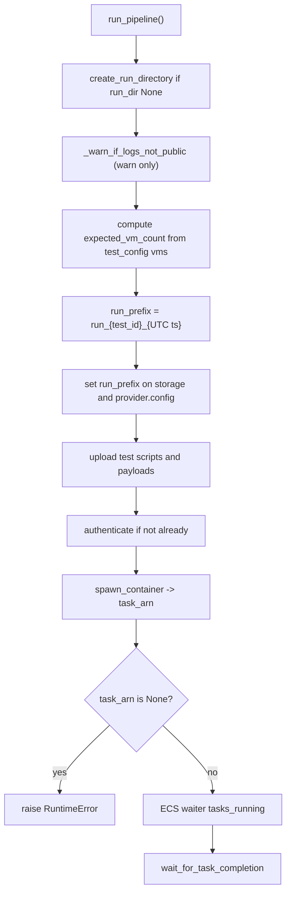
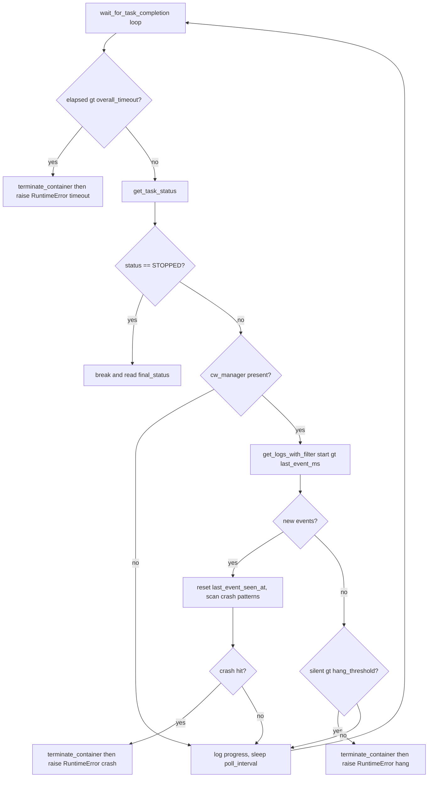

# Pipeline Orchestration - run_pipeline()

`run_pipeline(provider, storage, run_dir=None)` in `src/kernel_ci_cloud_labs/core/pipeline.py` is the single entry point that turns a resolved test configuration into a Fargate task, a fleet of guest VMs, on-disk log/artifact files, and a `summary.json`.

It is invoked from four places, all passing the same `(provider, storage[, run_dir])` shape:

- `pull_labs_poller.py` - `summary = run_pipeline(provider, storage)`
- `cli.py` - `run_pipeline(provider, storage, run_dir=run_dir)`
- `eventbridge_handler.py` - `run_pipeline(provider, storage, run_dir=run_dir)`
- `main.py` - `run_pipeline(provider, storage, run_dir=run_dir)`

The provider is concretely `AWSProvider` (`src/kernel_ci_cloud_labs/providers/aws_provider.py`), a subclass of abstract `BaseProvider` (`src/kernel_ci_cloud_labs/core/base_provider.py`), which declares only `authenticate`, `spawn_container`, and `stop_all_tasks` as abstract.

## 1. Run directory and the two timestamps

If no `run_dir` is passed, `run_pipeline` calls `create_run_directory()` (`core/logging_config.py`), which builds `logs/run_<ts>` where `<ts> = datetime.now().strftime("%Y%m%d_%H%M%S")` - **local** time.

This differs from the **S3 run prefix** computed later in `pipeline.py`:

```python
run_timestamp = datetime.now(timezone.utc).strftime("%Y%m%d_%H%M%S")
run_prefix = f"run_{test_id}_{run_timestamp}"
```

So `run_prefix` is `run_{test_id}_{UTC-timestamp}`. The local-time log directory and the UTC S3 prefix are independent timestamps and will not match in clock value off-UTC - keep this in mind when correlating local log folders to S3 keys.

First, `_warn_if_logs_not_public(provider, storage)` runs: a read-only probe of the bucket policy that only warns if the public-read boot-log policy is missing. It never aborts the run.

## 2. Expected VM count

Inside the `try` block, the test config is read from `provider.config`. For each entry in `test_config["vms"]`:

- `test` is a **list** -> every name added to `test_names`; `expected_vm_count += min_count * len(test_value)`.
- `test` is a **single** value -> added; `expected_vm_count += min_count`.

`min_count` defaults to `1` via `vm.get("min_count", 1)` in both branches. Used later only to detect a spawn shortfall in the summary.

## 3. run_prefix propagation, uploads, authentication

After computing `run_prefix`, it is pushed into both storage and provider config: `storage.set_run_prefix(run_prefix)` if available, and `provider.config["run_prefix"] = run_prefix`. The latter is what the `finally` cleanup re-reads and what `spawn_container` forwards to the container.

Test scripts and payloads are uploaded per unique test name. Authentication is lazy: `provider.authenticate()` runs only if `provider.auth.is_authenticated` is false, followed by an optional `provider.auth.wait_for_resources()` when resources were just created.

## 4. spawn_container() - the Fargate launch

`task_arn = provider.spawn_container()`. `AWSProvider.spawn_container` (`aws_provider.py`) builds `containerOverrides` environment variables and uploads the test config:

- Sets `RUN_PREFIX`, `S3_BUCKET`, `AWS_REGION`, `EC2_LOG_GROUP`, `KCI_DEBUG`.
- Uploads the full `test_config` JSON to S3 at `<run_prefix>/test_config.json` via `storage.upload_string`, passing only the bare filename `test_config.json` in `TEST_CONFIG_FILENAME` - the container reconstructs the full key.

The `run_task` call is wrapped in a retry loop of `max_retries = 5` with `2**attempt` backoff to ride out transient IAM-propagation errors. After the loop it raises on `response["failures"]` or when no tasks are returned, otherwise returns the task ARN.

Back in `run_pipeline`, a `None` `task_arn` raises `RuntimeError("Container spawn failed")`. The task is then waited to RUNNING with the ECS `tasks_running` waiter.



## 5. wait_for_task_completion() - polling with crash/hang detection

`final_status = provider.wait_for_task_completion()`. This method (`aws_provider.py`) is the heart of in-flight monitoring.

It reads four tunables from the environment with these defaults:

| Env var | Default |
|---|---|
| `PULLAB_TASK_POLL_INTERVAL_SEC` | `30` |
| `PULLAB_TASK_PROGRESS_LOG_SEC` | `120` |
| `PULLAB_TASK_HANG_THRESHOLD_SEC` | `600` |
| `PULLAB_TASK_WAIT_TIMEOUT_SEC` | `3600` |

`last_event_ms` is initialized to `start_ms - 1` because `filter_log_events`' `startTime` is **inclusive**; the `-1` ensures the first poll picks up events whose timestamp equals `start_ms`.

Crash detection is optional. `_build_vm_log_manager` returns `None` - disabling crash detection and falling back to pure status polling - unless **both** an `/ec2/` log group and a `run_prefix` are configured **and** a CloudWatch `logs` client can be obtained.

Each loop iteration:

1. If elapsed > `overall_timeout`: log error, call `self.terminate_container()`, raise `RuntimeError(f"task wait timeout exceeded after {int(elapsed)}s")`.
2. Get task status; if `STOPPED`, break.
3. If a CloudWatch manager exists, fetch new events with `get_logs_with_filter(start_time=last_event_ms + 1)`:
   - **New events**: reset `last_event_seen_at` to now, advance `last_event_ms`, run `_scan_for_kernel_crash`. A match logs an error, calls `self.terminate_container()`, raises `RuntimeError(f"kernel crash detected in VM: {msg}")`.
   - **Else** (`elif`): if more than `hang_threshold` seconds passed since `last_event_seen_at`, log a hang, call `self.terminate_container()`, raise `RuntimeError(f"no VM console output for {int(hang_threshold)}s")`.

All three abort paths (timeout, crash, hang) call `self.terminate_container()` **and then** raise. The hang check is an `elif` on the no-new-events branch - any new events reset `last_event_seen_at` first, so a hang is declared only during true console silence.

`_KERNEL_CRASH_PATTERNS` (`aws_provider.py`) is a tuple of compiled regexes covering:

- `Kernel panic - not syncing`
- `\bOops\s*:`
- `\bBUG\s*:`
- `general protection fault`
- `unable to handle kernel paging request`
- `double fault`
- `Internal error\s*:` (arm/arm64 die() banner)
- `watchdog: BUG: soft lockup`
- `soft lockup - CPU#`
- `rcu_(?:sched|preempt|bh) detected stalls`
- `INFO: task .* blocked for more than`



`get_task_status` handles `ExpiredTokenException` by refreshing the ECS client (`self.ecs = self.auth.get_client("ecs")`) and retrying `describe_tasks` once. The `auth` client factory for the default credential chain (`auth/aws_auth.py`) creates a fresh `boto3.Session().client(service, region_name=self.region)` per call, so each refresh re-resolves rotated temporary credentials.

## 6. container_failed and the shortened VM-log wait

After the wait returns, `run_pipeline` computes:

```python
container_failed = bool(final_status) and any(
    (c.get("exit_code") or 0) != 0
    for c in (final_status.get("containers") or [])
)
```

So `container_failed` is `True` when `final_status` is truthy and **any** container's exit code (treating `None` as `0`) is non-zero. The code keys off the non-zero test only, not a specific numeric exit code.

A non-zero container exit means the launcher died before any VM ran SSM, so the per-run `/ec2/.../<run_prefix>` log group never appears. The CloudWatch client is then refreshed to handle credentials that may have expired during the wait:

```python
cw_manager.client = provider.auth.get_client("logs")
```

## 7. Container log retrieval and the VM-log wait

Container logs are pulled with `cw_manager.get_all_logs(log_group, log_stream)` and written to `container.log`. The group/stream were computed earlier:

```python
log_group  = f"/ecs/{provider.config['ecs']['task_definition']['family']}"
log_stream = f"ecs/{provider.config['ecs']['task_definition']['container_name']}/{task_id}"
```

VM logs are retrieved next. The retry budget depends on `container_failed`:

- `container_failed is True` -> `max_retries = 1` (a single probe; the log group can't appear if no VM launched).
- otherwise -> `max_retries = 10`, with `retry_delay = 30`.

Each instance's events are grouped by instance ID and written to `vms/<instance_id>.log` with separate STDOUT/STDERR sections.

## 8. Boot logs, artifacts manifest, and the container-failure URL

`collect_run_artifacts` (`core/artifacts.py`) downloads each instance's boot log from S3 key `{run_prefix}/test_{test_name}/output/{instance_id}/console-output.log` to `vms/<instance_id>-console.log`, and writes `artifacts.json` carrying `schema_version`.

This pairs with `parse_vm_logs` (`pipeline.py`), which deliberately **skips** files ending in `-console.log` so boot logs are not double-counted or treated as failures. `parse_vm_logs` marks a VM `PASS` only if the literal string `"Test execution completed: SUCCESS"` is in the log content; everything else is `FAIL`.

When `container_failed` is true and `container.log` exists, the container's own log is uploaded to `s3://<bucket>/<run_prefix>/container-failure.log` and its public URL captured into `container_failure_log_url`. This URL is later threaded into the summary so KCIDB users land on the actual failure reason instead of an absent kernel log.

## 9. Benchmark analysis and save_results

Benchmark regression analysis runs best-effort, fully guarded by a broad `except`. Then `storage.save_results({"status": "success", "task_arn": task_arn})` is called. Note for the S3 backend `S3Storage.save_results` (`storage/s3_storage.py`) merely logs `"Saving: %s"` and does **not** persist anything - the durable record is `summary.json` plus the S3 objects.

## 10. The finally block - cleanup is unconditional

The `finally` block (`pipeline.py`) has **two independent try/except blocks**:

1. **Stop the task**: if `task_arn` is in locals and truthy, `provider.terminate_container(task_arn)`.
2. **Terminate VMs**: re-reads `provider.config["run_prefix"]`, then `ec2.describe_instances` with `Filters` `tag:run_prefix = [run_prefix]` and `instance-state-name` in `("pending", "running")`, collects instance IDs, and calls `ec2.terminate_instances(InstanceIds=...)`.

Because they are separate `try` blocks, a failure to stop the task does not prevent VM termination, and vice versa.

## 11. create_summary - runs after finally

`create_summary` (`pipeline.py`) is called **after** the `try/finally`, so the summary is produced even when the body raised (the `except` re-raises, but `finally` and the trailing `create_summary` still execute in the normal completion path; on an exception the function exits via the re-raise after `finally`). It is passed `container_failure_log_url` when set.

Status determination inside `create_summary`:

- starts as `"success"`;
- becomes `"partial_failure"` if `expected_vm_count` is known and `total_vms != expected_vm_count` (also logged at ERROR);
- becomes `"partial_failure"` if `vm_stats["failed"] > 0`.

There is **no `"failure"` status value** - the only two outcomes written are `"success"` and `"partial_failure"`.

## Key invariants to remember

- The S3 `run_prefix` is `run_{test_id}_{UTC-timestamp}`; the local log directory `logs/run_<ts>` uses local-time. They are independent timestamps.
- Crash detection is best-effort: absent an `/ec2/` log group **and** `run_prefix` **and** an obtainable logs client, `wait_for_task_completion` degrades to plain status polling.
- The only summary statuses are `success` and `partial_failure`.
- Cleanup (stop task + terminate VMs) always runs in `finally`, in two independent try blocks, and `create_summary` runs afterward.
