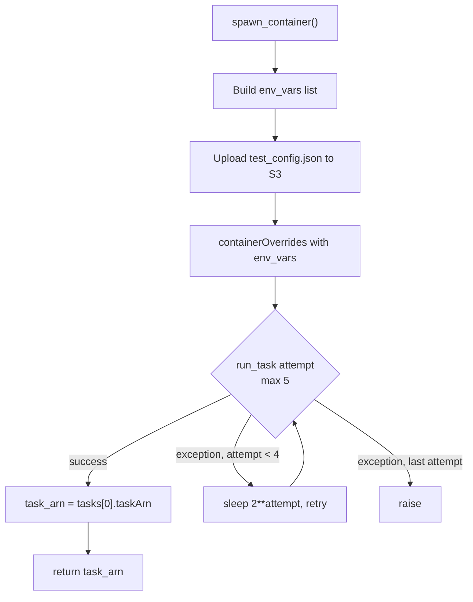
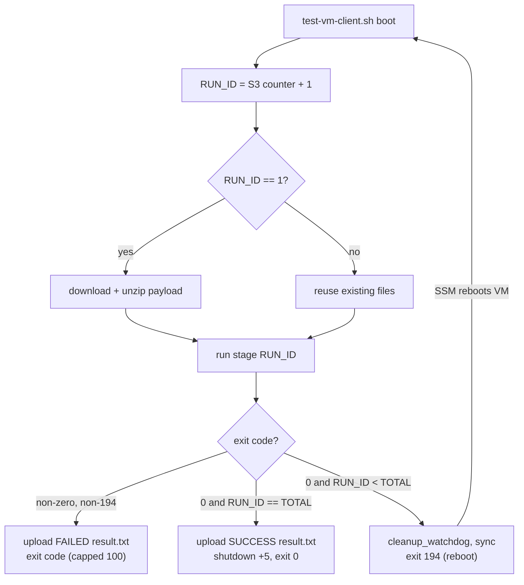

# Execution Layer - Fargate -> EC2 VMs -> SSM

This chapter traces how a kernel-CI job becomes a Fargate container, how that container launches throwaway EC2 VMs, and how those VMs run test stages over SSM with reboot support.

**Key files:**

- `src/kernel_ci_cloud_labs/providers/aws_provider.py` - Fargate orchestration (host side).
- `src/kernel_ci_cloud_labs/launch_vm.py` - in-container orchestrator that spawns EC2 VMs and drives them over SSM.
- `vm-tests/test-vm-client.sh` - guest-side client that runs test stages, persists state across reboots, and reports results.

The container image running `launch_vm.py` is built from `dockerfiles/aws/test.dockerfile`.

---

## 1. The big picture

Three nested layers hand off in sequence: Host poller (`pipeline.py`) -> Fargate task (`launch_vm.py`) -> EC2 VM (`test-vm-client.sh`). The VM uploads `result.txt`/logs to S3; the Fargate task reads S3 via `check_test_result()`; the host tails CloudWatch (`EC2_LOG_GROUP/run_prefix`), which SSM RunCommand stdout feeds.

The key design choice across all layers: **S3 is the source of truth for pass/fail**, not SSM command status nor the container exit code. SSM may report `Failed` simply because the VM shut down before SSM read back the final status, so `launch_vm.py` always re-checks `result.txt` in S3.

---

## 2. Layer 1 - Fargate orchestration (`aws_provider.py`)

### 2.1 Spawning the container

`AWSProvider.spawn_container()` builds container environment overrides and calls ECS `run_task`. The host poller invokes it from `pipeline.py`.

| Env var | Source |
|---|---|
| `RUN_PREFIX` | `config["run_prefix"]` |
| `S3_BUCKET` | `storage.bucket` |
| `AWS_REGION` | `config["region"]` |
| `EC2_LOG_GROUP` | the `/ec2/`-prefixed key in `cloudwatch.log_groups` |
| `KCI_DEBUG` | forwarded from the host's `KCI_DEBUG` env var |
| `TEST_CONFIG_FILENAME` | always `"test_config.json"` |

The `vms` array is **not** passed inline. The whole `test_config` object is serialized to JSON, uploaded to S3 at `{run_prefix}/test_config.json` via `storage.upload_string(...)`, and only the filename `test_config.json` is passed as `TEST_CONFIG_FILENAME`. The container rebuilds the full S3 key from `RUN_PREFIX` + filename.

`run_task` uses `launchType="FARGATE"`, `count=1`, `enableExecuteCommand=True`, wrapped in a 5-attempt retry loop with `2**attempt` backoff to absorb transient errors such as IAM propagation.



### 2.2 Waiting for completion with crash detection

`wait_for_task_completion()` polls task status until `STOPPED`. When both an `/ec2/` CloudWatch log group and a `run_prefix` are configured, it tails the per-run VM console group `{EC2_LOG_GROUP}/{run_prefix}` (where SSM RunCommand writes) and aborts early on any of:

- **Kernel crash/stall pattern** in the guest console - compiled regexes in `_KERNEL_CRASH_PATTERNS`: panic, `Oops:`, `BUG:`, GP fault, kernel paging fault, double fault, arm/arm64 `Internal error:`, soft lockup, RCU stall, hung-task. A hit calls `terminate_container()` and raises `RuntimeError`.
- **Silent stall** - no new VM console output for `PULLAB_TASK_HANG_THRESHOLD_SEC` (default 600).
- **Overall timeout** - `PULLAB_TASK_WAIT_TIMEOUT_SEC` elapsed (default 3600).

Poll/log intervals are env-tunable: `PULLAB_TASK_POLL_INTERVAL_SEC` (default 30) and `PULLAB_TASK_PROGRESS_LOG_SEC` (default 120). `terminate_container()` issues `ecs.stop_task`.

### 2.3 Reading the container exit code

After the task stops, `pipeline.py` reads the container exit code from `final_status`:

```python
container_failed = bool(final_status) and any(
    (c.get("exit_code") or 0) != 0
    for c in (final_status.get("containers") or [])
)
```

A non-zero container exit means `launch_vm.py` died before SSM ran on any VM, so the `/ec2/.../{run_prefix}` log group never appears; the pipeline then shortens its VM-log wait and surfaces the container log as the failure URL.

---

## 3. Layer 2 - VM orchestration (`launch_vm.py`)

The container entrypoint is `launch_vms_from_config()`. Per `dockerfiles/aws/test.dockerfile`, the image is `python:3.12-slim` with only `boto3` pip-installed, and the `CMD` is:

```
python -u /app/debug_aws_setup.py || true && python -u /app/launch_vm.py
```

A best-effort diagnostic pass followed by the launcher.

### 3.1 Config load and VM expansion

`launch_vms_from_config()` reads `RUN_PREFIX`, `S3_BUCKET`, `AWS_REGION` (default `us-west-2`), and `TEST_CONFIG_FILENAME` from the environment, downloads `{run_prefix}/{config_filename}` from S3, and parses it as JSON. `RUN_PREFIX`, `S3_BUCKET`, and `TEST_CONFIG_FILENAME` are required; any missing var aborts with `None`.

It then **expands** the `vms` array: each VM config's `test` field may be a list or scalar; the launcher emits one VM config per test into `expanded_vms`. For each expanded config it spawns `min_count` threads (default 1) running `launch_and_test_vm`.

### 3.2 Per-VM lifecycle

Each `launch_and_test_vm` thread runs a `VMLauncher` through `prepare_test_artifacts()` -> `spawn_vm()` -> `execute_test_via_ssm()` -> `check_test_result()`, with `cleanup()` in a `finally` block.

The success/failure decision is **S3-first**: it always calls `check_test_result()` after SSM, and even when SSM reported failure it records success if `result.txt` contains `SUCCESS`.

### 3.3 Spawning the EC2 VM

`spawn_vm()` calls `run_instances` with `MinCount=1`, `MaxCount=1`, `InstanceInitiatedShutdownBehavior="terminate"`, and a gp3 root volume on `/dev/xvda` with `DeleteOnTermination=True`. The instance is tagged with `Name`, `TestID`, and `run_prefix` - the `run_prefix` tag is what the IAM policy keys off of (see section 5).

If `ami_id` starts with `resolve:ssm:`, the launcher strips the prefix and resolves the remaining SSM parameter path via `ssm.get_parameter` (`_resolve_ssm_parameter`).

The user-data script installs a `nohup` self-shutdown firing after `max_runtime + 600` seconds - a safety net that terminates the VM if the orchestrator dies before sending the SSM command. It then waits for the SSM agent to become active.

### 3.4 Driving the test over SSM

`execute_test_via_ssm()` builds a shell command that downloads `test-vm-client.sh` from S3 and runs it with four positional args - `bucket run_prefix test max_runtime`. It sends this via SSM `AWS-RunShellScript`:

- `executionTimeout` and `TimeoutSeconds` are `min(max_runtime + 3600, 43200)` - capped at 12 hours.
- `CloudWatchOutputConfig.CloudWatchLogGroupName` is `{ec2_log_group}/{run_prefix}` - the same group `aws_provider.py` tails for crash detection.

It polls `get_command_invocation` every 5 seconds. On terminal SSM status `Success`/`Failed`/`TimedOut`/`Cancelled` it stops; on anything other than `Success` it captures the console buffer with `reason="ssm-failure"` and returns `False`. The `Failed` branch notes the VM may have shut down before SSM could report - which is why the S3 result check in section 3.2 is authoritative.

### 3.5 Console capture and cleanup

`capture_console_output(reason=...)` fetches the EC2 serial console (`get_console_output`), scrubs it, scans the **scrubbed** text for `PANIC_PATTERNS`, and uploads to `{run_prefix}/test_{test}/output/{instance_id}/console-output.log` with metadata `capture-reason`, `scrubbed=v1`, and `panic-detected`. Scrubbing runs `scrub_text()` before upload because the results bucket is public-read, so an unredacted secret would be world-visible; the panic scan runs on the scrubbed buffer so the logged marker can't re-leak a token.

Re-entrancy rules:

- `reason="cleanup"` - skipped if a previous call already captured a non-empty buffer.
- `reason="ssm-failure"` and `reason="post-terminate"` - always run.
- `reason="post-terminate"` - polls up to 540s at 15s intervals because EC2 finalizes the serial-console mirror only after shutdown.

`cleanup()` brackets `terminate_instances` with a pre-terminate capture (`reason="cleanup"`) and a post-terminate capture (`reason="post-terminate"`), each in its own `try/except`, and calls `_wait_for_terminated(timeout=90)` in between to let the buffer flush.

### 3.6 Final aggregation

`launch_vms_from_config()` joins all threads, counts successes, and returns `successful == total and total > 0`. In `__main__`, a `True` return maps to `sys.exit(0)`; both `False` (some/all VMs failed) and `None` (no VMs launched) map to `sys.exit(1)`.

---

## 4. Layer 3 - Guest-side client (`test-vm-client.sh`)

The VM downloads and runs `test-vm-client.sh` with args `<bucket> <run-prefix> <test-name> [timeout-seconds]`. If invoked as root, it re-executes itself as `ec2-user`/`ubuntu`/first `/home` user.

### 4.1 Per-instance RUN_ID state across reboots

The client tracks a per-instance `RUN_ID` counter persisted in S3 at `{run_prefix}/test_{test}/state/{instance_id}/run_id.txt`. On each boot it downloads the prior value (default 0), increments it, and uploads it back. The test payload zip is downloaded and unzipped **only when `RUN_ID == 1`**; later boots reuse the persisted working directory. A `RUN_ID` greater than the number of `run*.sh` scripts (`TOTAL_SCRIPTS`) is an error.

### 4.2 Independent watchdog

A self-contained watchdog (`start_watchdog`) is written out as a separate script and launched with `nohup`. It sleeps in 5s increments up to `SAFETY_TIMEOUT` (the 4th positional arg, default 1800) then runs `sudo shutdown -h now`. It is torn down cleanly via `cleanup_watchdog` before any reboot, completion, or failure exit.

### 4.3 The exit-code contract (reboot signaling)

The client runs the `run*.sh` stage for the current `RUN_ID`, captures `SCRIPT_EXIT_CODE` via `PIPESTATUS[0]`, then follows this contract:

- **Stage failed** (`SCRIPT_EXIT_CODE != 0` and `!= 194`): write a `FAILED` `result.txt` / `stats.json`, tear down the watchdog, and `exit $SCRIPT_EXIT_CODE`. Codes above 100 are capped at 100 first.
- **Last stage succeeded** (`RUN_ID == TOTAL_SCRIPTS`, exit 0): write a `SUCCESS` `result.txt` / `stats.json`, upload `benchmark-*.csv` and `results_*` files, tear down the watchdog, schedule `sudo shutdown +5`, and `exit $SCRIPT_EXIT_CODE` (i.e. 0).
- **More stages remain** (stage succeeded but `RUN_ID < TOTAL_SCRIPTS`): tear down the watchdog, `sync`, and `exit 194` to signal SSM that a reboot is needed; the SSM agent reboots the instance and re-runs this same script with the incremented `RUN_ID`.

The **194 reboot signal is emitted by `test-vm-client.sh` itself** based on `RUN_ID < TOTAL_SCRIPTS`, not by the individual stage scripts. The stage scripts exit 0 on success - e.g. `vm-tests/example-reboot-test/run-1.sh` and `vm-tests/example-kernel-reboot-test/run-01-install-first-kernel.sh` both `exit 0`. (The client does recognize 194 if a stage emits it directly, treating it as a reboot request, but the multi-stage reboot loop is driven by the client's own stage counter.)



---

## 5. Security boundary - IAM scoping by `run_prefix`

The execution layer bounds its blast radius through resource tags. The ECS task role's inline policy (`examples/aws/config.json`) restricts the two most dangerous actions to instances tagged `run_prefix=run_*`:

- `ec2:TerminateInstances` - scoped to `arn:aws:ec2:*:*:instance/*` with a `StringLike` condition on `aws:ResourceTag/run_prefix` of `run_*`.
- `ssm:SendCommand` against instances - scoped the same way via `ssm:resourceTag/run_prefix` `run_*`.

This is why `spawn_vm()` tags every instance with `run_prefix`: without that tag, the role could neither send the test command to the VM nor terminate it. `ec2:RunInstances`, `ec2:GetConsoleOutput`, and the describe/resolve actions are broader (`Resource: "*"`), but the state-changing terminate/command path is tag-gated.

---

## 6. End-to-end sequence

The recurring theme: **status flows up through S3, not through process exit codes.** SSM status, container exit codes, and the watchdog all exist to bound runtime and surface infrastructure failures, but the authoritative pass/fail signal for a test is `result.txt` in the S3 results bucket:

1. Host uploads `test_config.json`, then `spawn_container` (`run_task` FARGATE).
2. Fargate loads `test_config.json`, calls `run_instances` (tagging `run_prefix`), and sends SSM `AWS-RunShellScript` -> `test-vm-client.sh`.
3. The VM streams console output to `EC2_LOG_GROUP/run_prefix`; the host tails it for crash/hang.
4. Per stage, the VM uploads client/run logs and may `exit 194` -> SSM reboot when more stages remain.
5. On the last stage, the VM uploads `result.txt` + `stats.json` and runs `shutdown +5`.
6. Fargate runs `check_test_result` (`result.txt` is source of truth), then `cleanup` (capture console, terminate), and returns the container exit code to the host, which sets `container_failed = exit_code != 0`.
