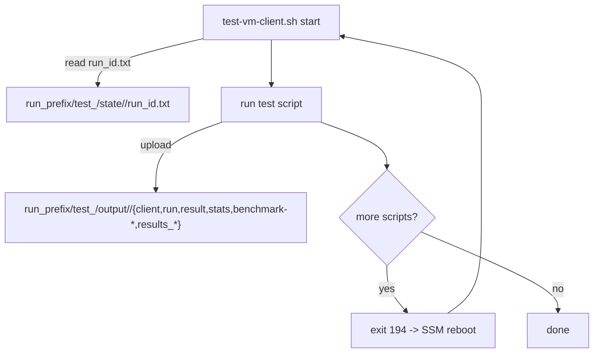
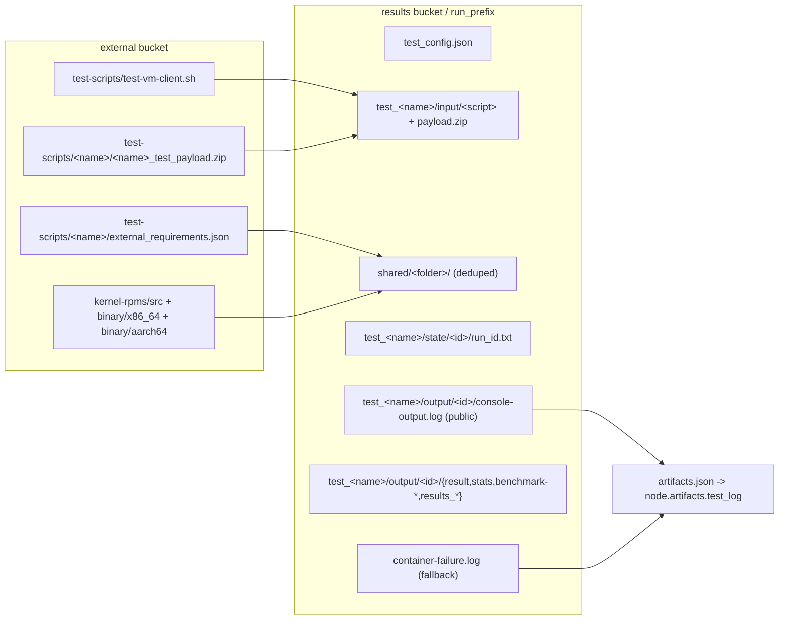

# Storage & Data Flow - S3 layout

This chapter traces every object `pullab_cloud` reads from or writes to S3, from naming a run through publishing a public kernel boot log. It is grounded in the source.

**Key files:** `storage/s3_storage.py`, `core/artifacts.py`, `core/pipeline.py`, `providers/aws_provider.py`, `vm-tests/test-vm-client.sh`, `launch_vm.py`, `pull_labs_poller.py`, `core/benchmark_analyzer.py`, `setup_upload_tests.py`, `setup_upload_rpms.py`, `setup_validate.py`.

## Two buckets, two roles

| Bucket | Config key | Role |
|---|---|---|
| **Results bucket** | `bucket` | Everything a run produces, namespaced under a per-run prefix. Created on demand; may carry a narrow public-read policy for boot logs. |
| **External storage bucket** | `external_storage.bucket` | Pre-populated, read-only-from-the-pipeline. Holds reusable inputs: VM client script, per-test payload zips, kernel RPMs. |

Note on the `pull_labs_jobs/` prefix: **this repo's `src/` never reads or writes it** (a grep returns nothing). It is a producer-side path written by the upstream `kernelci-core` runtime (`kernelci/runtime/pull_labs.py`, `PullLabs._store_job_definition`) into the external bucket as `pull_labs_jobs/<YYYYMMDD>/<uuid>.json`. pullab_cloud only fetches that job definition via the `artifacts.job_definition` URL handed to it by kernelci-api, never by constructing the key. See [07 - KernelCI & KCIDB Integration](07-kernelci-kcidb-integration.md).

> `S3Storage.__init__` reads `results_prefix` (default `"results"`), but it is **never** used to build any key. Run output is written directly under `run_<test_id>_<timestamp>/`, not under a `results/` prefix. Treat `results_prefix` as dead/vestigial config.

## The run prefix

The orchestrator names each run with one prefix that all keys hang off of, built in `pipeline.py`:

```python
run_timestamp = datetime.now(timezone.utc).strftime("%Y%m%d_%H%M%S")
run_prefix = f"run_{test_id}_{run_timestamp}"
```

Template: `run_{test_id}_{YYYYMMDD_HHMMSS}`, timestamp in **UTC**. The orchestrator pushes the prefix into the storage backend via `storage.set_run_prefix(run_prefix)` and into the provider config as `provider.config["run_prefix"]`.

## Bucket creation and the account-ID fallback

`S3Storage._ensure_bucket` head-checks the configured bucket:
- **No error** - use as-is.
- **404** - create the bucket.
- **403** (exists but inaccessible, typically the global name is taken by another account) - append the caller's AWS account ID and retry: `self.bucket = f"{self.bucket}-{account_id}"`. If reachable, use it; otherwise create it.

This is why the example IAM policy (`examples/aws/config.json`) grants access to **both** the bare and account-suffixed names: the `Resource` list includes `arn:aws:s3:::kernel-ci-exampleuser-results`, `.../*`, **and** `arn:aws:s3:::kernel-ci-exampleuser-results-*`, `.../*` - covering the `<bucket>-<account_id>` form the fallback may select.

## Inputs: what the run pulls in

### test_config.json

`AWSProvider.spawn_container` ships the test config through S3, not as a giant env var. It serializes `self.config["test_config"]` and uploads it via `storage.upload_string` to `f"{run_prefix}/{config_filename}"` (`config_filename = "test_config.json"`). The container receives **only** the basename via `TEST_CONFIG_FILENAME=test_config.json` and rebuilds the full key in `launch_vm.py`:

```python
config_key = f"{run_prefix}/{config_filename}"
```

The launcher refuses to start if `S3_BUCKET` or `TEST_CONFIG_FILENAME` is missing.

### Test scripts and payloads

- `upload_tests` places the VM client script at `{run_prefix}/test_{test_name}/input/{script_name}` (default `test-vm-client.sh`).
- `upload_test_payload` places the zipped test at `{run_prefix}/test_{test_name}/input/{test_name}_test_payload.zip`.

Both follow a **local-first, external-fallback** pattern:
- If a local `vm-tests/` dir exists, the file is zipped/read and uploaded directly.
- Otherwise it is copied from the external bucket: `_copy_from_external_storage("test-scripts/{script_name}", ...)` for the client, and `test-scripts/{test_name}/{test_name}_test_payload.zip` for the payload.

External bucket layout pre-populated by setup tooling:
- `test-scripts/test-vm-client.sh`, `test-scripts/<name>/<name>_test_payload.zip`, `test-scripts/<name>/external_requirements.json` (`setup_upload_tests.py`)
- RPMs (`setup_upload_rpms.py`): `kernel-rpms/src`, `kernel-rpms/binary/x86_64`, `kernel-rpms/binary/aarch64`

### Idempotent uploads via MD5 vs ETag

Both local-upload paths skip unchanged content: they compute `hashlib.md5(local_content).hexdigest()` and compare it to the existing object's `head_object(...)["ETag"].strip('"')`. If they match, the upload is skipped.

> Caveat: S3 ETag equals the body MD5 only for **single-PUT** objects. Both helpers upload the whole buffer in one `put_object` (`save_file`), so the comparison is valid here. It would silently break if switched to multipart uploads.

### External requirements -> the shared/ area

When a test declares external requirements, they are deduplicated into a per-run **shared** area so multiple tests don't recopy the same RPMs. `copy_external_requirements` reads each test's `external_requirements.json` and, for every enabled folder, copies it from the external bucket to `f"{self.run_prefix}/shared/{folder_name}/"`. Before copying it calls `_check_s3_folder_exists` (a `list_objects_v2(..., MaxKeys=1)`, non-empty `Contents` = "already present"); if present, the copy is skipped. The external-fallback path uses the same dedup via `_copy_external_requirements_from_s3`.

## Outputs: what the VM writes back

Inside each VM, `test-vm-client.sh` uses an `S3_PREFIX` that already includes the `test_<name>` segment, so all keys land under `run_prefix/test_<name>/...`.

Per-instance output objects under `run_prefix/test_<name>/output/<instance_id>/`:

| Object | Contents |
|---|---|
| `client-<RUN_ID>.log` | client wrapper log |
| `run-<RUN_ID>-output.log` | script stdout/stderr |
| `result.txt` | pass/fail string |
| `stats.json` | timing/metadata |
| `benchmark-*.csv` | benchmark outputs, uploaded by basename |
| `results_*` | arbitrary results files, uploaded by basename |

Multi-script tests reboot the VM between scripts: the client exits with **code 194**, which SSM interprets as "reboot and re-run" (documented in `vm-tests/README.md`). To survive the reboot the client persists its run counter as a tiny state object at `run_prefix/test_<name>/state/<instance_id>/run_id.txt` - read on start (default `0`) and rewritten after increment.



## The kernel boot console log

The console boot log is **not** uploaded by the in-VM client; it is captured by the launcher in the ECS container via the EC2 console-output API and written by `capture_console_output` (`launch_vm.py`). The buffer is scrubbed of secrets before upload (the bucket is public-read for these objects, so anything left would be world-visible), then a panic scan runs on the **scrubbed** buffer.

Uploaded to:

```
{run_prefix}/test_{test}/output/{instance_id}/console-output.log
```

with `ContentType="text/plain; charset=utf-8"` and metadata `capture-reason=<reason>`, `scrubbed=v1`, `panic-detected=true|false`.

This single key per instance is the only thing exposed publicly. `setup_validate.py` installs a bucket policy whose statement `Sid` is `PublicReadKernelBootLogs`, granting anonymous `s3:GetObject` on:

```
arn:aws:s3:::<bucket>/*/test_*/output/*/console-output.log
```

(pattern `_PUBLIC_LOGS_KEY_PATTERN = "*/test_*/output/*/console-output.log"`, assembled into the resource ARN). Everything else - payloads, `result.txt`, `stats.json`, benchmark CSVs - stays private.

## Collecting artifacts: the manifest

After CloudWatch logs are pulled, the orchestrator calls `collect_run_artifacts` (`artifacts.py`, invoked from `pipeline.py`). It:

1. Discovers `(test_name, instance_id)` pairs by walking `run_prefix/` with `Delimiter="/"` twice (`_discover_instances`). Leaves not starting with `test_` are skipped, deliberately excluding the bare `run_prefix/test_config.json`.
2. For each instance, downloads `console-output.log` to `run_dir/vms/<instance_id>-console.log`. A `NoSuchKey` is a quiet skip producing a `status: "missing"` entry.
3. Builds the public URL via `s3_public_url`, returning a **virtual-hosted-style** URL `https://<bucket>.s3.<region>.amazonaws.com/<key>`.
4. Writes `run_dir/artifacts.json`.

The manifest carries `schema_version = ARTIFACTS_MANIFEST_VERSION = 1`, plus `generated_at`, `run_prefix`, `s3_bucket`, `origin`, and an `artifacts` list. Each entry has: `test`, `instance_id`, `kind`, `kcidb_role`, `status` (`ready`/`missing`), `s3_uri`, `log_url`, `local_path`, `sha256`, `size_bytes`, `content_type`. The only known artifact kind is `console-output.log`, mapped to role `log` and content type `text/plain; charset=utf-8`.

## The KCIDB hand-off (currently indirect)

Direct KCIDB submission is **disabled**: in `pull_labs_poller.py` the `submit_tests(...)` call is commented out, and the dashboard never displayed the parallel `pull_labs_aws_ec2`-origin rows. Instead, per-instance `log_url` values are written back onto the maestro node's artifacts - the first goes to `outcome.artifacts["test_log"]`, extras to suffixed keys `test_log_<i>`. `kernelci-pipeline`'s `send_kcidb` then emits the single, dashboard-visible row from `artifacts.test_log`.

### Failure fallback: container-failure.log

If the ECS container exited non-zero **before any VM booted**, there is no kernel log to link. The orchestrator uploads the container's own log to `f"{run_prefix}/container-failure.log"` (`pipeline.py`) with `ContentType="text/plain; charset=utf-8"`, and its public URL (same `s3_public_url`) becomes the fallback `log_url`. This key sits directly under `run_prefix` and is therefore **not** matched by the public-read pattern (`*/test_*/output/*/console-output.log`); it is publicly readable only if a broader policy exists.

## Benchmark analysis reads back from output/

The benchmark analyzer reuses the output layout. `_analyze_test` lists `f"{self.run_prefix}/test_{test_name}/output/"`, filters to keys ending in `.csv` containing `benchmark-`, and classifies by filename: `benchmark-base-*` rows feed the baseline, `benchmark-tip-*` rows feed the candidate.

## End-to-end key map



## Summary of invariants

- All run state hangs off `run_{test_id}_{YYYYMMDD_HHMMSS}` (UTC).
- `results_prefix` exists in config but is never used.
- Inputs come from local `vm-tests/` first, else the external bucket under `test-scripts/` and `kernel-rpms/`.
- Reusable inputs are deduplicated into `run_prefix/shared/<folder>/`.
- Only `*/test_*/output/*/console-output.log` is public; everything else is private.
- The boot log is scrubbed before upload and is the only artifact surfaced to KCIDB, indirectly, via `node.artifacts.test_log`.
