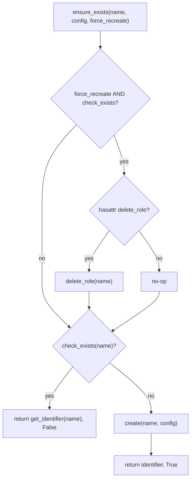
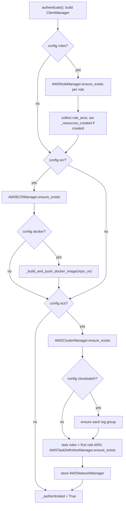

# AWS Resource Provisioning - ensure_exists

This chapter documents how `pullab_cloud` provisions the AWS resources a Fargate-launched kernel-CI test run depends on. Provisioning is constructor-driven, idempotent, and built on one small abstraction: the `ensure_exists` "check, then create" pattern in `core/base_resource_manager.py`. Every resource type (IAM role, ECR repo, ECS cluster, CloudWatch log group, ECS task definition) is a thin subclass supplying three primitives; the base class orchestrates them.

**Key files**

- `auth/aws_auth.py` - `AWSAuth.__init__`, `authenticate`, `wait_for_resources`, `_build_and_push_docker_image`
- `core/base_resource_manager.py` - `BaseResourceManager`, `ensure_exists`
- `core/client_manager.py` - `ClientManager`, `get_client`
- `aws_role_manager.py`, `aws_ecr_manager.py`, `aws_cluster_manager.py`, `aws_task_definition_manager.py`, `aws_cloudwatch_manager.py`, `aws_network_manager.py`
- `main.py` - `main`, `load_credentials`
- `core/pipeline.py` - `run_pipeline`
- `examples/aws/config.json`

---

## 1. Where provisioning starts: a constructor side effect

`AWSAuth.__init__` ends by calling `self.authenticate()` (`auth/aws_auth.py`). There is no separate "provision" step - constructing the auth object both authenticates **and** ensures every configured resource exists. `main.main()` triggers this via `auth = auth_class(config, credentials)` (`main.py`).

`authenticate()` is re-entry guarded: if `self._authenticated` is already `True` it returns immediately (`aws_auth.py`), so re-calls (e.g. via the lazy `get_client` / `get_credentials` fallbacks) are cheap.

---

## 2. Credential resolution and precedence

Before any resource is touched, `authenticate()` establishes a boto3 `Session`. Precedence is explicit-first, default-chain-second:

1. **Explicit credentials** - if both `access_key_id` and `secret_access_key` are present in the `credentials` dict (from `credentials.json`), a `Session` is built from them (including optional `session_token`) and validated with `sts.get_caller_identity()`. On any failure it logs and falls back (`self._session = None`).
2. **Default chain** - if no explicit session was established, `_check_credentials()` tries `sts.get_caller_identity()` against the default boto3 chain (env vars, `~/.aws/credentials`, IAM role). On success a default `Session` is created.
3. **No credentials** - if `self._session` is still `None`, `authenticate()` raises `ValueError` with guidance to add keys or run `aws configure`.

`credentials.json` is loaded by `main.load_credentials()`, which looks in the **same directory** as `config_path` via `os.path.join(os.path.dirname(config_path), "credentials.json")` and returns `None` (with a warning) if absent.

> Note: `_run_setup_script()` exists and would loop on `setup-iam-user.sh` until valid credentials appear, but `authenticate()` does **not** invoke it - it raises `ValueError` directly when no credentials resolve.

---

## 3. The auto-refreshing ClientManager

Service clients go through `ClientManager` (`core/client_manager.py`), not the session directly. The manager is created with a factory closure and a `refresh_interval` defaulting to **59 seconds**.

`get_client(service_name)` rebuilds a client when it is **missing OR older than `refresh_interval`**:

```python
if service_name not in self._clients or now - self._timestamps.get(service_name, 0) > self._refresh_interval:
    self._clients[service_name] = self._client_factory(service_name)
    self._timestamps[service_name] = now
```

The factory closure differs by credential mode (`aws_auth.py`):

- **Explicit-credential mode** - each call rebuilds a `boto3.Session` from the stored `access_key_id` / `secret_access_key` / `session_token`, then returns a client from it.
- **Default-chain mode** - each call does `boto3.Session().client(service, ...)`, so a fresh session re-resolves credentials (useful for short-lived assumed-role credentials that may refresh underneath the process).

---

## 4. The ensure_exists pattern

`BaseResourceManager` (`core/base_resource_manager.py`) is an ABC defining three abstract primitives - `check_exists`, `create`, `get_identifier` - and one concrete orchestrator, `ensure_exists`, which returns a **`(resource_identifier, was_created)` tuple**:

```python
def ensure_exists(self, resource_name, resource_config=None, force_recreate=False) -> tuple:
    if force_recreate and self.check_exists(resource_name):
        if hasattr(self, "delete_role"):
            self.delete_role(resource_name)
    if self.check_exists(resource_name):
        return self.get_identifier(resource_name), False
    config = resource_config or self.config.get(resource_name, {})
    identifier = self.create(resource_name, config)
    return identifier, True
```

Two easy-to-miss behaviors:

- **`force_recreate` is gated on `hasattr(self, "delete_role")`.** Only `AWSRoleManager` defines `delete_role`, so `force_recreate` deletes-and-recreates for IAM roles only; for the ECR, cluster, and task-definition managers it is effectively a **no-op** (they fall through to "exists? then return it").
- The `was_created` flag lets the caller decide whether to wait for AWS eventual consistency afterwards (see section 6).



---

## 5. The resource managers

Each manager is a small subclass implementing the three primitives:

| Manager | check_exists | create | Identifier |
|---|---|---|---|
| `AWSRoleManager` | `get_role` succeeds (else `NoSuchEntityException`) | `create_role` + attach managed/inline policies + instance profile for EC2 roles | role ARN |
| `AWSECRManager` | `describe_repositories` succeeds (else `RepositoryNotFoundException`) | `create_repository` with `scanOnPush` | repository URI |
| `AWSClusterManager` | `describe_clusters` returns a cluster with `status == "ACTIVE"`; any exception means absent | `create_cluster` | cluster ARN |
| `AWSTaskDefinitionManager` | `describe_task_definition` returns `status == "ACTIVE"`; any exception means absent | `register_task_definition` (FARGATE, awsvpc) | task definition ARN |
| `AWSCloudWatchManager` | `describe_log_groups` returns a non-empty prefix match | `create_log_group` + `put_retention_policy` | log group name |
| `AWSNetworkManager` | always `True` (uses default VPC) | returns `"default-vpc"` (no-op) | `"default-vpc"` |

Details worth calling out:

- **Cluster and task-definition existence both require `status == "ACTIVE"`** and treat any exception as "does not exist" (`aws_cluster_manager.py`, `aws_task_definition_manager.py`). This is deliberate: an `INACTIVE`/deregistered resource is treated as needing re-creation, not silently reused.
- **CloudWatch retention** defaults to **7 days**: `create` reads `resource_config.get("retention_days", 7)` and calls `put_retention_policy` (`aws_cloudwatch_manager.py`).
- **AWSNetworkManager** never provisions anything: `check_exists` returns `True` and `create` returns the literal `"default-vpc"`. The real work is in `get_network_config` (`aws_network_manager.py`) - it resolves `default-for-az` subnets, takes the **first two**, finds the default security group in the same VPC, and sets `assignPublicIp` to `"ENABLED"`.

### AWSRoleManager overrides ensure_exists to heal drift

`AWSRoleManager.ensure_exists` (`aws_role_manager.py`) calls `super().ensure_exists(...)` and then, **for EC2-trusted roles only**, always re-runs `_ensure_instance_profile(resource_name)`. The base implementation short-circuits when the role already exists, so a drifted instance profile (profile present but no role attached) would never be repaired on re-run; the override forces the binding check every time.

`_is_ec2_role` (`aws_role_manager.py`) inspects the trust policy's first statement `Principal` and returns `True` if `"ec2.amazonaws.com"` appears. `_ensure_instance_profile` (`aws_role_manager.py`) is independently idempotent for both create-profile and attach-role steps.

---

## 6. How authenticate() drives provisioning

After the `ClientManager` is built, `authenticate()` walks the config in a fixed order, calling `ensure_exists` on each configured section and recording whether anything new was created (`aws_auth.py`):

1. **IAM roles** - if `config["roles"]` is present, an `AWSRoleManager` is created and each role passed through `ensure_exists` with `force_recreate = config.get("force_recreate_roles", False)`. ARNs collect into `role_arns`; a created role sets `self._resources_created = True`.
2. **ECR repository** - `AWSECRManager.ensure_exists` returns the repo URI; a created repo sets `_resources_created`. If `config["docker"]` is present, `_build_and_push_docker_image(repo_uri)` runs.
3. **ECS cluster** - `AWSClusterManager.ensure_exists`; a created cluster sets `_resources_created`.
4. **CloudWatch log groups** - only if `config["cloudwatch"]` exists; each log group is ensured. (Created log groups do **not** flip `_resources_created`.)
5. **Task definition** - `task_config` is copied from `config["ecs"]["task_definition"]`, and **both** `execution_role_arn` and `task_role_arn` are set to `next(iter(role_arns.values()), None)` - the **first** role's ARN. Then `AWSTaskDefinitionManager.ensure_exists` registers it.
6. **Network manager** - an `AWSNetworkManager` is stored on `self._network_manager` for later `get_network_config()` calls.

Finally `self._authenticated = True`.



---

## 7. Docker image build / push

`_build_and_push_docker_image` (`aws_auth.py`) is the one provisioning step that shells out:

1. Read `docker` config: `dockerfile`, `build_context` (default `"."`), `tag` (default `"latest"`), `force_rebuild` (default `False`).
2. Unless `force_rebuild` is set, call `describe_images` for the tag. If the image **exists**, it logs, rewrites `config["ecs"]["task_definition"]["image"]` to the existing `{repo_uri}:{tag}`, and **returns early**.
3. If `describe_images` raises `ImageNotFoundException` (or `force_rebuild` is `True`), it gets an ECR auth token, `docker login`s, `docker build`s (with `--network host`), and `docker push`es.
4. It then rewrites `config["ecs"]["task_definition"]["image"]` to the freshly pushed URI so the subsequent task-definition registration uses the new image.

---

## 8. Waiting for eventual consistency

Newly created IAM roles and ECS resources are not immediately usable (AWS is eventually consistent). The `was_created` bookkeeping feeds a single decision in `run_pipeline` (`core/pipeline.py`):

```python
if hasattr(provider.auth, "resources_were_created") and provider.auth.resources_were_created():
    provider.auth.wait_for_resources()
else:
    logger.debug("Using existing resources, no propagation delay needed")
```

So the propagation wait is **skipped entirely** when nothing was created.

`wait_for_resources()` (`aws_auth.py`) uses boto3 waiters:

- For each configured role name, an IAM `role_exists` waiter.
- If ECS is configured, a `role_exists` waiter on the service-linked role `"AWSServiceRoleForECS"`.
- If a cluster is configured, a final `describe_clusters` verification.

---

## 9. Worked example: the bundled config

`examples/aws/config.json` exercises the full path. It sets `"force_recreate_roles": true`, so on every run the single configured role `kernel-ci-exampleuser-ecs-role` is deleted and recreated (the only manager for which `force_recreate` is not a no-op). That role's trust policy lists both `ecs-tasks.amazonaws.com` and `ec2.amazonaws.com`, so `_is_ec2_role` is `True` and an instance profile is created/healed. The same ARN is used as both the task definition's `execution_role_arn` and `task_role_arn`.

The config also declares an ECR repo (`kernel-ci-exampleuser-ecr`), a Docker build (`force_rebuild: true`), an ECS cluster (`kernel-ci-exampleuser-cluster`), a task family (`kernel-ci-exampleuser-task`), and two CloudWatch log groups (`/ecs/...` retention 7 days, `/ec2/...` retention 3 days).

---

## 10. Summary of guarantees

- Provisioning is **constructor-driven**: building `AWSAuth` runs the full ensure-exists sweep.
- Every resource type implements the same three primitives and inherits the same idempotent orchestration; only `AWSRoleManager` can delete/recreate.
- `force_recreate` is meaningful only for IAM roles (gated on `hasattr(self, "delete_role")`).
- `AWSRoleManager` additionally self-heals drifted EC2 instance-profile bindings on every run.
- The expensive eventual-consistency wait happens only when something was actually created, tracked via the `(identifier, was_created)` tuple.
