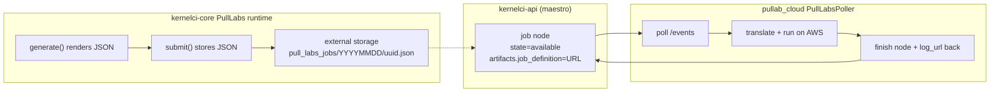
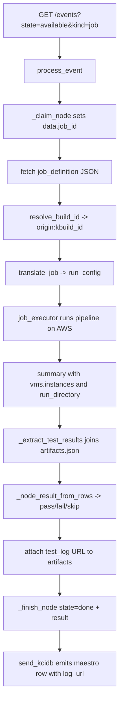

# KernelCI & KCIDB Integration - the pull-lab bridge

This chapter documents how `pullab_cloud` bridges the KernelCI ecosystem (the `kernelci-api` "maestro" event service and the KCIDB results database) to the AWS-backed test pipeline. It is a "pull-lab": instead of maestro pushing jobs at a runtime, the runtime *polls* maestro for jobs it can run, executes them, and reports results back.

**Key files:**

- `pullab_cloud/src/kernel_ci_cloud_labs/pull_labs_poller.py` - the long-lived poller / orchestrator.
- `pullab_cloud/src/kernel_ci_cloud_labs/pull_labs_translate.py` - translates a PULL_LABS job definition into a `pullab_cloud` run config.
- `pullab_cloud/src/kernel_ci_cloud_labs/kcidb_submit.py` - builds and (when enabled) submits KCIDB `tests[*]` rows.
- `kernelci-core/kernelci/runtime/pull_labs.py` - the upstream KernelCI runtime that *produces* PULL_LABS job definitions and stores them for labs to pull.

## 1. The two halves of the protocol

PULL_LABS is pull-based, with two cooperating sides:

1. **Producer (upstream KernelCI):** `kernelci-core`'s `PullLabs(Runtime)` class renders a JSON job definition from a template (`PullLabs.generate`), then `submit()` *stores* that JSON in external storage rather than dispatching it. `submit()` returns `None` because pull-based labs pick up jobs asynchronously. `_store_job_definition` builds the storage path `pull_labs_jobs/<YYYYMMDD>/<uuid>.json` from `time.strftime("%Y%m%d")` and `uuid.uuid4().hex`, uploaded via `storage.upload_single(...)`.
2. **Consumer (this repo):** `PullLabsPoller` polls `kernelci-api` for job events, fetches each job's `job_definition` JSON, translates it, runs it on AWS, and writes results back.



## 2. The polling loop

The poller polls `kernelci-api` `/events`, claims each job by recording `data.job_id`, fetches the `job_definition`, translates and runs it, submits to KCIDB, then marks the node done.

`_events_url` builds the query with these exact parameters:

```
GET {api_base_uri}/events?state=available&kind=job&recursive=true&limit=1000&from=<ts>
```

The `from` value is a cursor timestamp persisted by `FileCursorStore`, defaulting to `DEFAULT_FROM_TIMESTAMP = "1970-01-01T00:00:00.000000"` and the file `/tmp/pullab_cloud_cursor.json`. `poll_once` reads the cursor, fetches events, processes each, then writes the last event's timestamp back.

> Note: the upstream reference tool `kernelci-pipeline/tools/example_pull_lab.py` differs deliberately - it polls `state=done`, uses `requests`, runs `tuxrun`, waits for `input()` before launching, and defaults to `--group-filter pull-labs` / `--platform qemu-x86_64`. The production poller polls `state=available` (jobs not yet run) using stdlib `urllib`, runs the AWS pipeline, and never blocks on interactive input.

## 3. Claiming a node

`kernelci-api` has no node *state* usable as a "claimed" marker. Its state machine (`Node.validate_node_state_transition` using `state_transition_map`) allows:

```
running   -> [available, closing, done]
available -> [closing, done]
closing   -> [done]
done      -> []
```

There is **no** `available -> running` edge, so an `available` job cannot be promoted to `running`. A same-state transition returns `True` early, so `available -> available` is a no-op the API accepts.

`_claim_node` therefore claims by writing `data.job_id` - the "Runtime job ID" field (`TestData.job_id`, used by both `Test` and `Job` nodes; the build-node analogue is the identically-named `KbuildData.job_id`). Procedure:

1. Re-read the node (`GET /node/<id>`).
2. Require `state == "available"`; skip otherwise.
3. Skip if `data.job_id` is already set (already claimed).
4. Set `data.job_id = f"{runtime_name}:{uuid.uuid4().hex}"`.
5. Strip `NODE_READ_ONLY_FIELDS` and `PUT` the full document back.

The node is left in `available`; the claim is purely the `job_id` marker and is **best effort** - `kernelci-api` has no compare-and-set, so two pollers that both read before either writes can each claim the same node. Parallel pollers must be partitioned by platform (`KERNELCI_PLATFORMS`).

`NODE_READ_ONLY_FIELDS` is exactly: `id`, `_id`, `created`, `updated`, `user`, `user_groups`, `owner`, `submitter`, `treeid`, `processed_by_kcidb_bridge`, `retry_counter`, `timeout`. These are omitted from PUT payloads to avoid FastAPI/Pydantic validation rejections.

## 4. Per-event processing

`process_event` runs each event end to end:

1. `_matches_runtime` - skip unless `node.data.runtime == runtime_name`.
2. `_matches_platform` - skip unless `node.data.platform` is in the `KERNELCI_PLATFORMS` allowlist (`None` accepts all).
3. `_job_definition_url` - skip unless `node.artifacts.job_definition` is an `http` URL.
4. `_claim_node` - skip if it cannot be claimed.
5. `_execute_job` in a `try`, with `_finish_node` in a `finally` so an owned node is always finished. The default outcome before success is `NodeOutcome("incomplete", _ERR_INFRASTRUCTURE, "unexpected internal error")`.

`_execute_job`:

- Fetches the `job_definition` JSON (fetch failure -> `incomplete` / `Infrastructure`).
- Resolves `build_id` via `resolve_build_id`.
- Translates with `translate_job` (`ValueError` -> `incomplete` / `invalid_job_params`).
- Runs `self.job_executor(run_config)`; an executor exception is an infrastructure failure: emits a single `{"name": "boot.infrastructure", "status": "ERROR"}` row and marks the node `incomplete`.
- Builds KCIDB `tests[*]` rows with `build_test_row` (test id is `f"{node_id}.{instance_suffix}"`).
- If no rows came back, emits one synthetic `path="boot"` `ERROR` row and marks the node `incomplete`.

### 4.1 Node result derivation

`_node_result_from_rows` maps test statuses to a node result for a job that actually ran:

- Any of `FAIL`, `ERROR`, `MISS` present -> `"fail"`.
- Else any of `PASS`, `DONE` present -> `"pass"`.
- Else `SKIP` present -> `"skip"`.
- Else -> `"fail"`.

It **never** returns `"incomplete"` - that value is reserved for infrastructure failures and is decided by the caller (`_execute_job`). Those caller-side codes come from the `ErrorCodes` enum (`kernelci-core/kernelci/api/models.py`): `INVALID_JOB_PARAMS = "invalid_job_params"` and `INFRASTRUCTURE = "Infrastructure"`, surfaced in the poller as module constants `_ERR_INVALID_JOB_PARAMS` and `_ERR_INFRASTRUCTURE`.

### 4.2 Finishing the node

`_finish_node` re-reads the node, sets `state="done"` and `result`, and on an infrastructure failure also sets `data.error_code` / `data.error_msg`. It **merges** (not replaces) any `outcome.artifacts` into the node's existing `artifacts` dict so it never clobbers `job_definition`, then strips `NODE_READ_ONLY_FIELDS` and PUTs.

## 5. Build-id resolution

`resolve_build_id` walks `node.parent` upward looking for a `kbuild` ancestor, up to **8 hops**. On finding one it returns `f"{origin}:{kbuild_node['id']}"`, mirroring the convention in `kernelci-pipeline/src/send_kcidb.py` (`"id": f"{origin}:{node['id']}"`). If no `kbuild` ancestor is found the caller (`_execute_job`) falls back to `f"{origin}:unknown_{node_id}"`.

## 6. Translation

`translate_job` deep-copies `base_config` and rewrites `test_config` for the job. It requires `artifacts.kernel` **and** `artifacts.modules`, raising `ValueError` otherwise.

`DEFAULT_PLATFORM_MAP`:

| arch              | instance_type  | AMI hint                                          |
|-------------------|----------------|---------------------------------------------------|
| `x86_64`          | `c5a.4xlarge`  | AL2023 `...al2023-ami-kernel-default-x86_64`       |
| `arm64`/`aarch64` | `c6g.4xlarge`  | AL2023 `...al2023-ami-kernel-default-arm64`        |

`DEFAULT_TEST_TYPE_MAP`: `baseline`, `ltp`, `unixbench` all map to `url-kernel-boot`. Unknown types fall back to `url-kernel-boot` via `_resolve_test_dir`, which uses `test_type_map["_default"]` if present, else the literal `"url-kernel-boot"`.

The `test_params` dict carries:

- `KERNEL_URL`, `MODULES_URL`, `ARCH` (always).
- `ROOTFS_URL` (only if `artifacts.rootfs` or `artifacts.ramdisk` present).
- `KERNELCI_NODE_ID` (only if `node_id` was passed).
- `PULL_LABS_TESTS` (only if the job has tests) - a comma-joined list of `id:type` pairs.

The job `timeout` defaults to `3600`, is coerced to `int`, and maps to the VM entry's `max_runtime`. Each job becomes exactly one entry in `test_config.vms[*]` (one VM per job).

## 7. KCIDB submission

`kcidb_submit.py` builds tests-only KCIDB revisions. `STATUS_MAP`:

- `pass`/`ok`/`success` -> `PASS`
- `fail`/`failed` -> `FAIL`
- `skip`/`skipped` -> `SKIP`
- `error`/`errored`/`incomplete` -> `ERROR`
- `miss` -> `MISS`
- `done` -> `DONE`

`to_kcidb_status` defaults to `ERROR` for any unknown or empty value.

`build_test_row` validates `origin` against `^[a-z0-9_]+$` (`validate_origin`) and `path` against dot-separated `[A-Za-z0-9_-]` segments (`validate_test_path`), raising `ValueError` on an invalid value so a bad test name fails locally rather than at the ingester.

### 7.1 Direct submission is disabled

Direct KCIDB submission is currently **disabled**. The `submit_tests(...)` call is preserved as a commented-out block, and the `build_test_row` machinery is kept so `_node_result_from_rows` still works and dual submission can be re-enabled cheaply.

The reason: the old direct submission posted rows under origin `pull_labs_aws_ec2`, producing a parallel row keyed `(pull_labs_aws_ec2, <node_id>.<instance_id>)` that KCIDB stored but the dashboard never displayed - the dashboard renders the **maestro-origin** row (`origin=maestro`, `id=maestro:<node_id>`) emitted by kernelci-pipeline's `send_kcidb`.

The new flow instead writes the boot-log URL onto the maestro node's `artifacts` under the `test_log` key (extra URLs from multi-VM jobs under suffixed `test_log_<n>` keys). `send_kcidb` then picks it up: `_get_artifacts` walks the parent chain when a node has no artifacts of its own, and the test-node parser sets `log_url = artifacts.lava_log` if present, else `artifacts.test_log`. A `test_log` value written on the job node is thus visible to every test descendant.

## 8. Artifact collection

`collect_run_artifacts` (`core/artifacts.py`) runs after VM logs are pulled. For every `(test_name, instance_id)` discovered under the run prefix in S3, it downloads the boot console log and writes an `artifacts.json` manifest whose entries carry a `log_url` built by `s3_public_url` from the S3 key:

```
{run_prefix}/test_{test}/output/{instance_id}/console-output.log
```

The public URL form is `https://<bucket>.s3.<region>.amazonaws.com/<key>` and only resolves when the bucket carries the public-read policy. Each manifest entry is keyed by `test` and `instance_id`; the poller's `_load_artifact_log_urls` indexes them by the `(test, instance_id)` tuple to attach a `log_url` to each test row.

## 9. Executor and pipeline

The default executor `_default_job_executor` instantiates the auth, provider, and storage classes from the `AUTH_REGISTRY` / `PROVIDER_REGISTRY` / `STORAGE_REGISTRY` registries, calls `run_pipeline(provider, storage)`, and returns `_extract_test_results(summary)`.

`run_pipeline` (`core/pipeline.py`) returns the dict produced by `create_summary`. That summary dict includes `run_directory`, `vms.instances[]` (per-instance ground truth), and `container_failure_log_url`. The per-run S3 prefix is `run_{test_id}_{datetime}` (`f"run_{test_id}_{run_timestamp}"`, timestamp `%Y%m%d_%H%M%S` UTC).

`_extract_test_results` emits one row per VM instance from `summary["vms"]["instances"]`, joining with `artifacts.json` on `(test, instance_id)` to attach `log_url`. It falls back to legacy per-test aggregation when `instances` is absent, and sets the second tuple element to `summary["container_failure_log_url"]` so a container-died-before-boot failure still links to the container log.

### 9.1 Boot-test path remapping

`_BOOT_TEST_NAMES` is the frozenset `{"baseline", "url-kernel-boot", "boot"}`. `_test_name_to_path` remaps any of these to the path `"boot"` so the KernelCI dashboard's `is_boot()` classifier treats the row as a boot test; every other name passes through unchanged (then validated by `build_test_row`).

## 10. Configuration and entry points

### 10.1 Credential resolution

`_resolve_kcidb_endpoint` picks the KCIDB submit URL and token in priority order:

1. `KCIDB_SUBMIT_URL` + `KCIDB_JWT` (both set).
2. `KCIDB_REST` (kci-dev form `https://<token>@host/submit`).
3. `UNIFIED_TOKEN` as the JWT, paired with `KCIDB_SUBMIT_URL` if set, else config `kcidb_submit_url`.
4. config `kernelci.kcidb_submit_url` + `kernelci.kcidb_jwt`.

The kernelci-api token precedence is `KERNELCI_API_TOKEN` > `UNIFIED_TOKEN` > config `api_token`.

`_parse_kcidb_rest` parses `https://<token>@host[/path]`, extracts the username as the token, rebuilds the host (with port if any), and ensures the path ends with `/submit`.

### 10.2 Token preflight

`_validate_api_token` calls `GET /whoami` once at startup and checks that the user is a superuser or a member of one of: `node:edit:any`, `runtime:<name>:node-editor`, `runtime:<name>:node-admin`. It is never fatal - a transient API error must not stop the poller from starting.

### 10.3 Environment variables

All optional, falling back to the `kernelci` section of `config.json`:

| Env var                    | Purpose                                       |
|----------------------------|-----------------------------------------------|
| `KERNELCI_API_BASE_URI`    | maestro API base URI                          |
| `KERNELCI_API_TOKEN`       | maestro API token                             |
| `KERNELCI_RUNTIME_NAME`    | runtime/lab name to match jobs against        |
| `KERNELCI_PLATFORMS`       | comma-separated platform allowlist            |
| `KCIDB_SUBMIT_URL`         | KCIDB `/submit` URL                           |
| `KCIDB_JWT`                | KCIDB bearer token                            |
| `KCIDB_ORIGIN`             | KCIDB origin string                           |
| `KCIDB_REST`               | combined kci-dev `https://<token>@host/submit`|
| `UNIFIED_TOKEN`            | shared fallback for API token and KCIDB JWT   |
| `PULLAB_CURSOR_FILE`       | cursor file path                              |
| `PULLAB_POLL_INTERVAL_SEC` | poll interval seconds                         |
| `PULLAB_BASE_CONFIG`       | path to the base config JSON                  |

### 10.4 Entry points

- `main`: CLI. `--once` runs a single `poll_once` and exits; otherwise `run_forever` loops, sleeping `poll_interval_sec` only when a cycle processed zero events.
- `lambda_handler`: AWS Lambda entry point that runs a single `poll_once` per invocation, with config read from env vars (and an optional `config_path` in the event payload), returning `{"status": "ok", "processed": <n>}`.

## 11. End-to-end data flow


