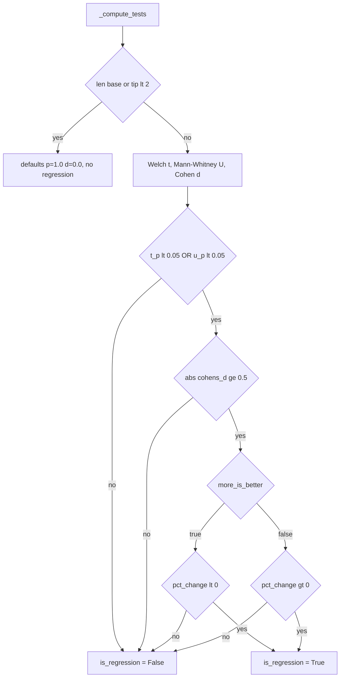
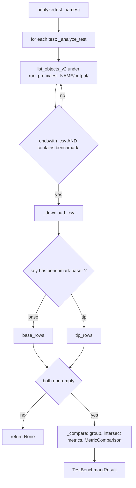
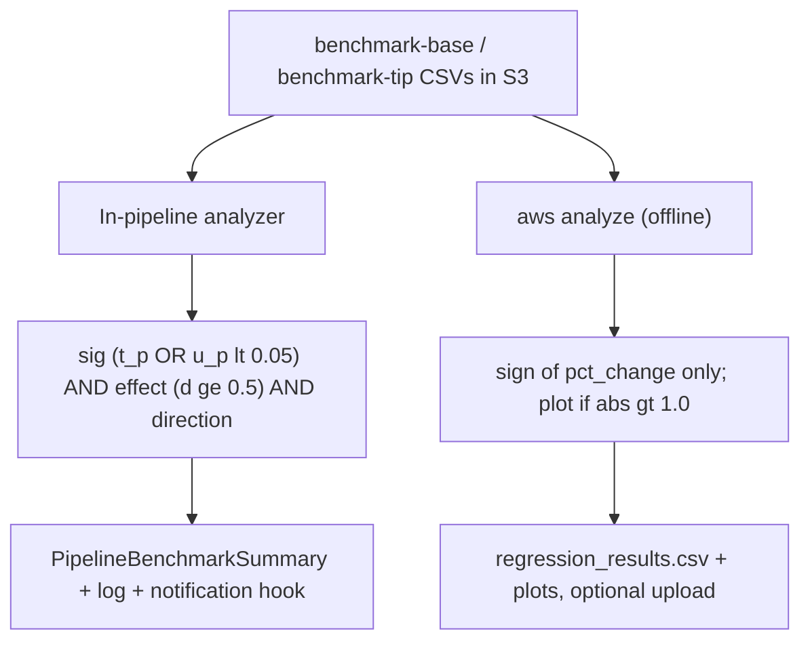

# Benchmark Regression Analysis & Tooling

This chapter covers two adjacent concerns in `pullab_cloud`: the **benchmark regression analysis** subsystem (raw per-VM CSV metrics -> statistical regression verdicts) and the **operational tooling** around it (setup validation, configuration, uploads, cleanup, secret scrubbing). Both live under `src/kernel_ci_cloud_labs/` and run either inline in the pipeline or via `aws ...` CLI subcommands.

**Two distinct regression engines** exist, and the distinction matters:

| Engine | Module | Invoked by | Gate for "regression" |
|---|---|---|---|
| **In-pipeline analyzer** | `core/benchmark_analyzer.py` | `core/pipeline.py` (inline, post-run) | significance (p-value) **AND** effect size (Cohen's d) **AND** direction |
| **Offline analysis CLI** | `analysis/analyze_regressions.py` | `aws analyze` -> `analysis/run_analysis.py` | **sign of percent change only** (no significance/effect gate) |

Same CSV schema, different verdicts. The analyzer is conservative (requires statistical evidence); the offline CLI is a visualization/plotting pipeline that flags any directional change.

**Key files:** `core/benchmark_analyzer.py`, `core/pipeline.py`, `analysis/run_analysis.py`, `analysis/analyze_regressions.py`, `analysis/download_results.py`, `core/log_scrub.py`, `launch_vm.py`, `setup_validate.py`, `setup_configure.py`, `setup_upload_rpms.py`, `setup_upload_tests.py`, `setup_cleanup.py`, `cli.py`, `vm-tests/unixbench-kernel-regression/common_lib.sh`.

---

## 1. The benchmark CSV contract

Both engines read the same CSV schema emitted by the in-VM test harness. The header is written in `vm-tests/unixbench-kernel-regression/common_lib.sh`:

```
metric,unit,value,more_is_better,kernel_version,instance_id,instance_type,arch
```

(documented in `vm-tests/unixbench-kernel-regression/README.md`). `more_is_better` is computed per metric in the same awk block: every metric defaults to `"true"`; the **only** metric forced to `"false"` is `System_Call_Overhead` (a latency-style metric where larger is worse).

The two CSV "sides" come from different run scripts:

- `benchmark-base-*.csv` - written by `run-02-run-unixbench-setup-kernel-B.sh` (`summarize_unixbench_log ... "benchmark-base-...csv"`).
- `benchmark-tip-*.csv` - written by `run-03-run-second-unixbench.sh`.

These filenames are load-bearing: the in-pipeline analyzer routes rows by the `benchmark-base-` / `benchmark-tip-` substring in the S3 key (see section 3).

---

## 2. Statistical core (`core/benchmark_analyzer.py`)

### Thresholds

Two module-level constants gate a regression:

```python
P_VALUE_THRESHOLD = 0.05    # significance
COHENS_D_THRESHOLD = 0.5    # meaningful effect size
```

### Dataclasses

- `MetricStats` - value list deriving `mean`, `median`, `stddev` (sample, divides by `n-1`), and `cv` (coefficient of variation) in `__post_init__`. `stddev` computed only when `n > 1`; `cv` is `stddev/abs(mean)`, or `0.0` when `mean == 0`.
- `MetricComparison` - base/tip `MetricStats` plus computed statistics; `__post_init__` computes `pct_change`, then calls `_compute_tests()` and `_detect_regression()`.
- `TestBenchmarkResult` - aggregates comparisons for one test; exposes `regressions` / `has_regression`.
- `PipelineBenchmarkSummary` - aggregates across all tests, tracking `regression_test_names`, `tests_with_regression`, and failed-test bookkeeping.

### Test computation (`_compute_tests`)

If **either** sample has fewer than 2 values (`len(base_v) < 2 or len(tip_v) < 2`), it returns early with dataclass defaults (`t_pvalue = 1.0`, `u_pvalue = 1.0`, `cohens_d = 0.0`). Otherwise it computes Welch's t-test, Mann-Whitney U, and pooled Cohen's d.

### Regression decision (`_detect_regression`)

```python
significant = self.t_pvalue < P_VALUE_THRESHOLD or self.u_pvalue < P_VALUE_THRESHOLD
meaningful  = abs(self.cohens_d) >= COHENS_D_THRESHOLD
if not (significant and meaningful):
    self.is_regression = False
    return
if self.more_is_better:
    self.is_regression = self.pct_change < 0
else:
    self.is_regression = self.pct_change > 0
```

All three must hold for a regression:

1. **Significant** - `t_pvalue < 0.05` **OR** `u_pvalue < 0.05` (either test crossing suffices).
2. **Meaningful** - `abs(cohens_d) >= 0.5` (AND-ed with significance).
3. **Wrong direction** - for `more_is_better` metrics a drop (`pct_change < 0`) regresses; otherwise a rise (`pct_change > 0`) does.



### Pure-Python statistics (no scipy/numpy)

All helpers are hand-rolled so the analyzer carries no scientific dependencies:

- `_welch_t_test` - unequal-variance t-test with Welch-Satterthwaite df; returns `(0.0, 1.0)` if either sample is `< 2` or standard error is `0`.
- `_mann_whitney_u` - rank-based U test with average-rank tie handling, reduced to a two-tailed p-value via normal approximation (`_normal_cdf`). (Docstring says "n >= 8" but the code applies the approximation unconditionally.)
- `_cohens_d` - pooled-stddev effect size; returns `0.0` if either sample is `< 2` or pooled std is `0`.
- `_normal_cdf` - standard normal CDF via `math.erfc`.
- `_t_distribution_two_tailed_p` - for `df > 100` uses the normal approximation; otherwise the regularized incomplete beta function.
- `_regularized_incomplete_beta` - Lentz continued-fraction evaluation with `max_iter = 200` and early break on delta convergence.

---

## 3. S3 ingestion and comparison (`BenchmarkAnalyzer`)

`BenchmarkAnalyzer` is constructed with `(s3_client, bucket, run_prefix)`.

`analyze(test_names, vm_success_map=None)` seeds a `PipelineBenchmarkSummary`, optionally records success/fail counts from `vm_success_map`, then iterates each test name through `_analyze_test`, appending results and tallying regressions.

`_analyze_test` lists objects under `f"{self.run_prefix}/test_{test_name}/output/"` and, for each key, **skips anything that is not a `.csv` and does not contain `benchmark-`**. Surviving rows route by substring: `benchmark-base-` -> base rows, `benchmark-tip-` -> tip rows. The whole S3 traversal is wrapped in a broad `try/except` that logs a warning and returns `None` on failure; if either side is empty it also returns `None`.

`_compare` extracts `kernel_version` from the first row of each side, groups both sides via `_group_by_metric`, then iterates `sorted(set(base_by_metric) & set(tip_by_metric))` - i.e. **only metrics present in both** sides, sorted - building a `MetricComparison` per metric.

`_group_by_metric` parses each row: skips rows with empty `metric`, parses `value` via `float(...)` and **skips the row on `ValueError`/`TypeError`**, and defaults `more_is_better` to `"true"`, treating it as `True` only when the lowercased string equals `"true"`.



### Reporting and the notification hook

`log_benchmark_summary` renders a human-readable report: per test it logs base/tip kernel, metric count, and for each regression the means, stddevs, CVs, percent change, both p-values, and Cohen's d. It ends by listing `regression_test_names`. A documented **notification hook** comment block marks where downstream alerting (SNS, KCIDB, Slack/email, bisection triggers) would attach, noting that `PipelineBenchmarkSummary` supplies the structured payload (`regression_test_names`, per-metric stats, p-values, effect sizes).

---

## 4. Pipeline wiring (`core/pipeline.py`)

After a run, the pipeline performs benchmark analysis inline inside a broad `try/except`:

```python
test_names = list({t for vm in provider.config["test_config"]["vms"]
                   for t in vm.get("test", [])})
s3_client = provider.auth.get_client("s3")
analyzer = BenchmarkAnalyzer(s3_client, storage.bucket, run_prefix)
benchmark_summary = analyzer.analyze(test_names)   # no vm_success_map
log_benchmark_summary(benchmark_summary)
```

Verified details:

- `analyze` is called **without** a `vm_success_map`, so the summary's success/fail counts stay at defaults.
- A second copy of the notification-hook comment lives in `pipeline.py`, pointing back at `BenchmarkAnalyzer`.
- The block is guarded by `except Exception` that logs `"Benchmark analysis skipped: %s"` - a benchmark failure never fails the pipeline.

---

## 5. Offline analysis path (`aws analyze`)

The CLI `cmd_analyze` (`cli.py`) imports `analysis.run_analysis.main`; on `ImportError` it prints `"Analysis requires extra dependencies"` and the hint `pip install -e '.[analysis]'`, then exits. It builds an args namespace with the fixed `file_pattern="benchmark-*.csv"`.

### `run_analysis.main` - three steps

1. **Download** - builds a `download_args` namespace and calls `download_results.main`; returns `1` if it fails.
2. **Analyze** - calls `analyze_regressions.main`; returns `1` on failure.
3. **Optional upload** - only if `args.upload_analysis` is set, `upload_analysis_to_s3` pushes the combined CSV, regression CSV, and any `plots/*.png` to `{run_prefix}/analysis/`.

### Download (`download_results.py`)

`download_csvs_from_s3` paginates the whole `run_prefix`, keeping a key only if it **contains `/output/`** and its basename matches the pattern. Local files are named `f"{test_name}_{instance_id}_{Path(key).name}"`, where `test_name` strips the `test_` prefix from path part `[1]` and `instance_id` is path part `[3]`. `main` rejects any `file_pattern` not ending in `.csv`.

### Offline regression math (`analyze_regressions.py`)

`calculate_regression_simple` is the key contrast with the in-pipeline analyzer: per metric it computes `pct_change` from the two kernel means and flags `is_regression` purely on the **sign** of `pct_change` relative to `more_is_better` - **no significance test, no effect-size gate**. Only rows with `abs(percent_change) > 1.0` are passed to the plotter (`results_for_plot`).

`main` loads the combined CSV, derives `kernel_base` by stripping a trailing `.x86_64` / `.aarch64` / `.arm64` suffix from `kernel_version`, requires **at least 2** distinct kernels, and compares the **two lowest** sorted kernels (`kernel_a, kernel_b = kernels[0], kernels[1]`). It produces an overall slice, then per-architecture slices for `x86_64` and `aarch64|arm64`, concatenates results, and writes the regression CSV.

---

## 6. Secret scrubbing for public logs (`core/log_scrub.py`)

Kernel boot console buffers are uploaded to a **public-read** prefix and their URLs published to KCIDB, so they are scrubbed at the upload boundary.

`_RULES` is an ordered list - order matters where patterns overlap (more-specific wins):

| Order | Rule name | Matches | Behavior |
|---|---|---|---|
| 1 | `pem-private-key` | `-----BEGIN ... PRIVATE KEY-----` ... `-----END ... PRIVATE KEY-----` (DOTALL) | full redaction |
| 2 | `ssh-public-key` | `ssh-rsa`/`ed25519`/`dss`/`ecdsa-*` + base64 body (40+) | full redaction |
| 3 | `jwt` | `eyJ...eyJ....` three base64url segments | full redaction |
| 4 | `github-token` | `(ghp\|gho\|ghu\|ghs\|ghr)_` + 36+ chars | full redaction |
| 5 | `aws-access-key-id` | `(AKIA\|ASIA)` + 16 chars | full redaction |
| 6 | `bearer-token` | `Bearer <token>` (case-insensitive) | **keeps** `"Bearer "` (group 1), redacts the token |
| 7 | `credential-kv` | secret-named `KEY=VALUE` / `KEY: VALUE` | **keeps** the `KEY=`/`KEY:`, redacts the value |

`scrub_text` returns `("", {})` on empty input; otherwise the scrubbed string plus a `{rule_name: hits}` counter (zero-hit rules omitted). The substitution marker is `[REDACTED:{kind}]`.

### Upload integration (`launch_vm.py`)

In `capture_console_output`, the decoded buffer is scrubbed **before** upload. Redaction **counts** are logged, never the originals. The kernel-panic scan runs on the **scrubbed** text so a logged marker cannot re-leak a token. The object is written to:

```
{run_prefix}/test_{test}/output/{instance_id}/console-output.log
```

with object `Metadata` recording `"scrubbed": "v1"` (alongside `capture-reason` and `panic-detected`).

---

## 7. Setup validation (`setup_validate.py`)

`validate(...)` runs an ordered battery of checks and returns `0` only if **all** pass (`return 0 if all(results.values()) else 1`). Order:

1. `aws_credentials`
2. `ec2_describe`
3. `ec2_console_output`
4. `ssm`
5. *(optional, only if `role_name` given)* `iam_role`, `instance_profile`
6. `s3_bucket` - and **only if the bucket exists/was created**, `s3_logs_public_policy`
7. `kernelci_api_token`
8. `kcidb_jwt`

### Environment variables

Held as plain strings to avoid a circular import on the poller:

```
KERNELCI_API_BASE_URI   (ENV_API_BASE_URI)
KERNELCI_API_TOKEN      (ENV_API_TOKEN)
KCIDB_SUBMIT_URL        (ENV_KCIDB_URL)
KCIDB_JWT               (ENV_KCIDB_JWT)
KCIDB_REST              (ENV_KCIDB_REST)
UNIFIED_TOKEN           (ENV_UNIFIED_TOKEN)
```

### Console-output permission probe

`check_console_output_permission` deliberately calls `get_console_output` against the non-existent instance id `"i-0000000000000000f"` so the only thing under test is the IAM action. A `NotFound`/`Malformed` error means the call was authorized (pass); `UnauthorizedOperation`/`AccessDenied` is the failure case.

### Public-read bucket policy

The bucket is configured for **public access via bucket policy only** - ACLs stay blocked. `_create_s3_bucket` sets the PublicAccessBlock with `BlockPublicAcls=True`, `IgnorePublicAcls=True`, `BlockPublicPolicy=False`, `RestrictPublicBuckets=False`; the same shape is enforced by `_check_public_access_block`.

The narrow public-read statement uses key pattern `"*/test_*/output/*/console-output.log"` (`_PUBLIC_LOGS_KEY_PATTERN`) and Sid `"PublicReadKernelBootLogs"` (`_PUBLIC_LOGS_SID`) - matching the console-log key layout from `launch_vm` (section 6). Everything else (payloads, results, benchmark CSVs) stays private. With `--fix`, `_check_bucket_policy_statement` merges the expected statement into the existing policy, replacing any prior statement carrying the same Sid.

> **Production safety note.** Setting `BlockPublicPolicy=False` / `RestrictPublicBuckets=False` deliberately relaxes a public-access safeguard so the boot-log policy is accepted. It is scoped to a single narrow `s3:GetObject` statement and ACL-based public access remains blocked, but it is still a public-exposure surface - pair it with the `log_scrub` pass (section 6) and confirm the bucket is intended to host only world-readable boot logs before applying `--fix`.

---

## 8. Configuration and resource lifecycle tooling

### `setup_configure.py`

`get_default_prefix` returns `f"kernel-ci-{user}-"` from `$USER`. `update_config` strips the trailing dash to form `base` and derives every resource name from it:

- S3 buckets: `{base}-results` and `{base}-storage`
- IAM role key: `{base}-ecs-role`
- ECR repository: `{base}-ecr`
- ECS cluster: `{base}-cluster`; task family: `{base}-task`
- CloudWatch log groups: `/ecs/{base}-task` and `/ec2/{base}-vms`

It also rewrites IAM policy ARNs to track the renamed role/buckets: the `AllowPassRole` resource, the optional `AllowIAMInstanceProfile` resource, and the `AllowS3Access` resource list.

### `setup_upload_rpms.py`

`upload_to_s3` places RPMs under a fixed layout:

```
kernel-rpms/src
kernel-rpms/binary/x86_64
kernel-rpms/binary/aarch64
```

Uploads are size-verified by `verify_s3_upload`, which re-`head_object`s and compares `ContentLength` to local size with up to `retries=3` and exponential backoff (`2**attempt`).

### `setup_upload_tests.py`

`upload_to_s3` uploads `test-scripts/test-vm-client.sh` once, then for **each subdirectory containing at least one `run*.sh`** writes a zip to `test-scripts/{name}/{name}_test_payload.zip` and, when present, uploads `external_requirements.json` **separately** to `test-scripts/{name}/external_requirements.json` so the pipeline can read it without unzipping.

### `setup_cleanup.py`

The tool **lists by default and deletes only with `--delete`** (closing guidance: `"Run with --delete to remove these resources"`). `delete_iam_role` unwinds in order: detach managed policies, delete inline policies, remove the role from its instance profile and delete that profile, then delete the role. Beyond prefix-derived resources it also checks the legacy default names `ecsTaskExecutionRole` and the `kernel-ci-test` ECR repository.

---

## 9. Summary of the two regression verdicts

The single most important takeaway: a "regression" means different things in the two code paths.



The pipeline path is the authoritative pass/fail signal; the offline `aws analyze` path is a reporting/visualization aid that intentionally trades statistical rigor for a complete directional picture across architectures.
