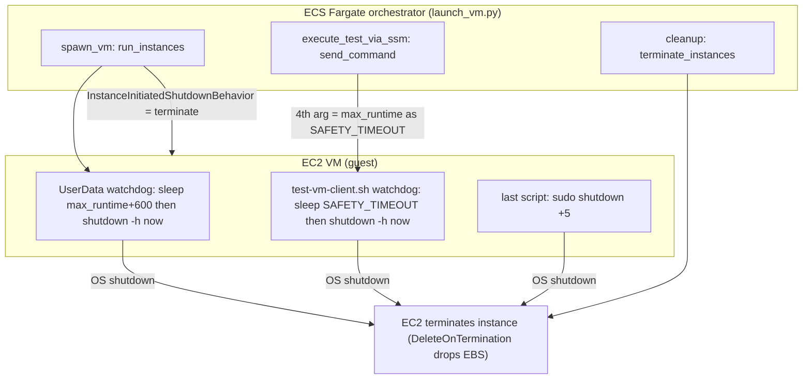
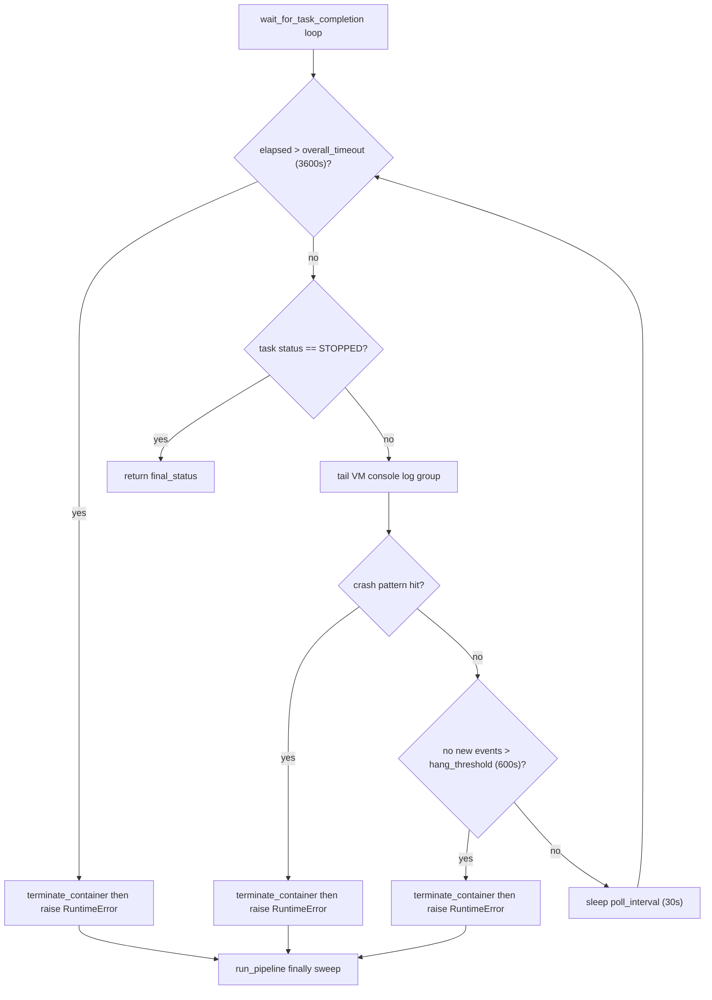

# Cost & Resource-Leak Prevention

Every test run in `pullab_cloud` spins up real, billable AWS infrastructure: one ECS Fargate orchestrator task plus one or more EC2 VMs (each with an attached EBS root volume), CloudWatch log groups, and S3 objects. An orphaned `c5a.4xlarge` VM is the single most expensive failure mode. The codebase uses layered, defense-in-depth mechanisms so that no compute keeps running and no storage keeps accruing once a run is over - even when the orchestrator dies, SSM never connects, the guest kernel panics, or a thread crashes silently.

**Key files:** `launch_vm.py`, `aws_provider.py`, `pipeline.py`, `test-vm-client.sh`, `aws_cloudwatch_manager.py`, `base_resource_manager.py`, `setup_cleanup.py`, `examples/aws/config.json`.



---

## 1. The keystone: instance self-termination

The most important guarantee: an EC2 VM deletes itself and its disk if it ever shuts down its own OS, regardless of why. Two `run_instances` parameters in `launch_vm.py:spawn_vm` make this true:

- `InstanceInitiatedShutdownBehavior="terminate"`. Any in-guest `shutdown -h now` (or `shutdown +N`) does not merely *stop* the instance - it *terminates* it. This converts every guest-side safety timer into a hard cost stop.
- `BlockDeviceMappings` for `/dev/xvda` with `Ebs.DeleteOnTermination=True`, `VolumeType="gp3"`, `VolumeSize=self.root_volume_size`. On termination the root EBS volume is deleted with the instance, so terminated VMs leave no lingering block storage.

Because of these two settings, *any* path reaching an OS shutdown inside the guest results in full teardown (compute + disk). The remaining mechanisms exist to make sure such a shutdown - or an external `terminate_instances` - always eventually happens.

---

## 2. Guest-side safety timers (two independent watchdogs + a fallback)

| Mechanism | Timer | Covers | Action |
|---|---|---|---|
| UserData watchdog | `max_runtime + 600` (10-min buffer) | orchestrator dies before sending SSM command | `shutdown -h now` -> terminate |
| In-test watchdog (`SAFETY_TIMEOUT`) | `= max_runtime` (4th arg; default `1800` only if absent) | test hangs mid-run | `shutdown -h now` -> terminate |
| Post-completion fallback | `shutdown +5` | script exits but instance doesn't terminate | delayed shutdown -> terminate |

### 2a. UserData watchdog - survives orchestrator death

The cloud-init `UserData` arms a detached watchdog *before* it waits for the SSM agent (`launch_vm.py`):

```bash
nohup bash -c 'sleep {self.max_runtime + 600}; \
echo "UserData safety timeout reached, shutting down"; shutdown -h now' &>/dev/null &
```

The sleep is `max_runtime + 600` (`max_runtime` plus a 10-minute buffer). Its in-code comment states it "catches the case where the orchestrator dies before sending the SSM command". Because it is armed before the `while ! systemctl is-active --quiet amazon-ssm-agent` wait loop, even a VM that never becomes SSM-manageable self-terminates after `max_runtime + 600` seconds. This backstop means the VM does not depend on any external actor to die.

### 2b. In-test watchdog - bounds the active test run

`launch_vm.py:execute_test_via_ssm` invokes the client with `max_runtime` as the 4th positional argument:

```bash
/tmp/test-vm-client.sh {self.s3_bucket} {self.run_prefix} {self.test} {self.max_runtime}
```

Inside the script that 4th arg becomes `SAFETY_TIMEOUT` (`test-vm-client.sh`):

```bash
SAFETY_TIMEOUT=${4:-1800} # Default 30 minutes if not provided
```

The literal `1800` default applies only when the 4th arg is absent; the orchestrated path always supplies `max_runtime` (3600s in the example config), so the effective window equals `max_runtime`, not 1800s. `test-vm-client.sh:start_watchdog` writes a separate `watchdog_runner.sh` and launches it with `nohup`; it sleeps in 5-second increments up to `SAFETY_TIMEOUT`, then runs `sudo shutdown -h now`. It is cancellable: `test-vm-client.sh:cleanup_watchdog` removes an active-flag file and sends `SIGTERM` (escalating to `SIGKILL`) to the watchdog PID, so a normally-progressing multi-script run can stand the watchdog down between reboots.

### 2c. Post-completion fallback shutdown

After the final test script succeeds, the client schedules `sudo shutdown +5` (a 5-minute delayed shutdown) as a belt-and-suspenders fallback "in case the script exits but instance doesn't terminate". Combined with the `terminate` shutdown behavior, this guarantees teardown even if no external terminate call ever arrives.

---

## 3. Orchestrator-side timeouts and crash detection

### 3a. SSM command timeout (12-hour hard cap)

`launch_vm.py:execute_test_via_ssm` computes one timeout for both the SSM command and the local wait loop:

```python
total_timeout = min(self.max_runtime + 3600, 43200)  # max 12 hours
```

Base + a 1-hour (3600s) reboot buffer, hard-capped at 43200s (12 hours). It is passed as both `executionTimeout` (in `Parameters`) and the top-level `TimeoutSeconds` of `send_command`, and bounds the polling `while` loop.

On a terminal SSM status:
- `Success` -> return `True`.
- `Failed` -> soft warning ("VM may have shut down before SSM could report"), captures console buffer, returns `False` - the real verdict comes from S3 (`check_test_result`).
- `TimedOut` / `Cancelled` -> logged as error, console buffer captured, returns `False`.
- All non-`Success` terminal cases call `capture_console_output(reason="ssm-failure")` to grab the kernel tail before teardown.

If the local wait loop instead exhausts `total_timeout` without a terminal status, it calls `ssm.cancel_command(...)` then `capture_console_output(reason="ssm-failure")` before returning `False`. Note: `cancel_command` is invoked only on this outer-loop-timeout path, not on the per-status terminal branch.

### 3b. ECS task wait loop - crash, hang, and overall-timeout aborts

`aws_provider.py:wait_for_task_completion` polls the ECS task to `STOPPED` while tailing the per-run VM console log group, aborting early on three conditions. All four tunables are env-var overridable:

| Env var | Default | Role |
|---|---|---|
| `PULLAB_TASK_POLL_INTERVAL_SEC` | `30` | poll/sleep cadence |
| `PULLAB_TASK_PROGRESS_LOG_SEC` | `120` | progress-log cadence (cosmetic) |
| `PULLAB_TASK_HANG_THRESHOLD_SEC` | `600` | max silence before declaring a hang |
| `PULLAB_TASK_WAIT_TIMEOUT_SEC` | `3600` | overall wait ceiling |

Each abort path calls `self.terminate_container()` then raises `RuntimeError`:
- **Overall timeout** - `elapsed > overall_timeout` -> stop task, raise.
- **Kernel crash/stall** - `_scan_for_kernel_crash` matches a guest console line (panic, Oops, `BUG:`, GP fault, kernel paging fault, double fault, arm/arm64 `Internal error:`, soft lockup, RCU stall, hung task) -> stop task, raise.
- **Hang** - no new console events for more than `hang_threshold` seconds -> stop task, raise.

`terminate_container` is `ecs.stop_task(cluster=..., task=arn_to_stop)`. Crash detection is best-effort: it falls back to plain status polling when there is no `/ec2/` log group or no `run_prefix` configured.



---

## 4. Pipeline `finally` sweep - the unconditional cleanup

`pipeline.py:run_pipeline` wraps the whole orchestration in `try/except/finally`. The `finally` block always runs (on success or any exception) and performs two independently guarded teardown steps:

1. **Stop the ECS task** - `provider.terminate_container(task_arn)` (i.e. `ecs.stop_task`), only if `task_arn` is in locals and truthy, in its own `try/except`.
2. **Sweep this run's VMs** - `ec2.describe_instances` filtered by *both* `tag:run_prefix == <this run's run_prefix>` *and* `instance-state-name in ["pending", "running"]`, then `ec2.terminate_instances(InstanceIds=...)` for matches, in a second separate `try/except`.

The two-key filter (run_prefix tag AND state) is deliberate: it only terminates instances belonging to *this* run that are still consuming compute, and never touches `stopping`/`stopped`/`terminated` instances or instances from other runs. The per-instance tags that make this filter work (`Name`, `TestID`, `run_prefix`) are stamped at launch in `launch_vm.py:spawn_vm`, where `Name = "<ec2_log_group leaf>-<test_id>"`, `TestID = test_id`, `run_prefix = run_prefix`.

This sweep is the orchestrator's primary leak-stopper for the normal case; the guest-side watchdogs of section 2 cover the case where the orchestrator never reaches its `finally`.

---

## 5. Thread-level guarding (no silent leaks from worker crashes)

VMs are launched on one Python thread each (`launch_vm.py`). Each worker's `launch_and_test_vm` calls `launcher.cleanup()` in its own `finally`, *and* wraps that call in a second `try/except` so an unhandled exception escaping the thread surfaces a traceback rather than silently skipping teardown. `cleanup()` itself terminates the instance via `terminate_instances` with each stage individually guarded - so a console-capture failure cannot abort the terminate call.

---

## 6. Storage-cost controls

### 6a. CloudWatch log retention

`aws_cloudwatch_manager.py:create` always sets a retention policy on log-group creation, defaulting to 7 days if none is specified:

```python
retention_days = resource_config.get("retention_days", 7)
self.client.put_retention_policy(logGroupName=resource_name, retentionInDays=retention_days)
```

The example config (`examples/aws/config.json`) sets per-group retention explicitly:
- `/ecs/kernel-ci-exampleuser-task` -> `retention_days: 7`
- `/ec2/kernel-ci-exampleuser-vms` -> `retention_days: 3`

So VM console/SSM logs (the higher-volume `/ec2/` group) expire after 3 days; orchestrator logs after 7. Without an explicit value, the code default of 7 applies. (The example config's `region` is `eu-west-2`; VM sizing is `instance_type: c5a.4xlarge`, `root_volume_size: 40`, `max_runtime: 3600`.)

### 6b. EBS

Covered by section 1: `DeleteOnTermination=True` means root volumes never outlive their instance.

---

## 7. Manual reconciliation: `setup_cleanup.py` (read-only by default)

`setup_cleanup.py:main` is the out-of-band janitor for cleaning up by resource prefix. It is read-only unless `--delete` is passed; `--delete` is an opt-in `store_true`, and without it the tool only lists what it found and prints "Run with --delete to remove these resources". The prefix `base` is derived as `args.prefix.rstrip("-")`. With `--delete`, it sweeps:

| Resource | Match criteria | Delete action |
|---|---|---|
| EC2 instances | `tag:Name` in `["<prefix>*", "kernel-ci-test-*"]` AND state in `pending/running/stopping/stopped` | `terminate_instances` |
| ECS tasks | RUNNING tasks in `<base>-cluster` | `stop_task` each |
| ECS cluster | `<base>-cluster` if ACTIVE | `delete_cluster` |
| Task-def families | `familyPrefix=<base>`, status ACTIVE | deregister all ACTIVE revisions |
| IAM role | `<base>-ecs-role` AND default `ecsTaskExecutionRole` | detach managed + delete inline policies, remove/delete instance profile, delete role |
| ECR repo | `<base>-ecr` AND default `kernel-ci-test` | `delete_repository(force=True)` |
| Log groups | prefixes `/ecs/<base>` and `/ec2/<base>` | `delete_log_group` each |
| S3 buckets | name starts with `<base>` | empty all objects, then `bucket.delete()` |

Two "default-name extras" are swept beyond the prefixed names: the IAM role `ecsTaskExecutionRole` and the ECR repo `kernel-ci-test`. This tool is the safety net for resources left behind by an aborted setup or a run that escaped both the guest watchdogs and the pipeline sweep.

> Production-safety note: `setup_cleanup.py --delete` performs irreversible deletions (terminating instances, deleting clusters/roles/repos, emptying and deleting S3 buckets). Treat any prefix you cannot positively identify as non-production as production, and run list-only (no `--delete`) first to review the matched set.

---

## 8. Idempotent provisioning (avoids duplicate-resource cost)

Resource managers extend `base_resource_manager.py:ensure_exists`, which is idempotent: it calls `check_exists` first and returns `(identifier, False)` without creating anything if the resource already exists; recreation is opt-in via `force_recreate` (default `False`), which only deletes-then-recreates when the resource both exists and a `delete_*` hook is present. This prevents the slow leak of duplicated clusters, roles, log groups, and repositories across repeated setup runs.

---

## Summary of layers

| Layer | Trigger it covers | Mechanism | Result |
|---|---|---|---|
| `InstanceInitiatedShutdownBehavior="terminate"` + `DeleteOnTermination=True` | any guest OS shutdown | EC2 instance + EBS deleted | no orphan compute/disk |
| UserData watchdog (`max_runtime + 600`) | orchestrator dies before SSM | `shutdown -h now` -> terminate | self-healing VM |
| Test-client watchdog (`SAFETY_TIMEOUT = max_runtime`) | test hangs mid-run | `shutdown -h now` -> terminate | bounded active run |
| `shutdown +5` fallback | script exits without terminating | delayed `shutdown` -> terminate | post-completion backstop |
| `execute_test_via_ssm` `min(max_runtime+3600, 43200)` | SSM stuck | command timeout + cancel + console capture | bounded orchestrator wait |
| `wait_for_task_completion` (30/600/3600) | crash / hang / overall timeout | `stop_task` + raise | early abort of wedged task |
| `run_pipeline` `finally` sweep | normal end + any exception | `stop_task` + tagged `terminate_instances` | guaranteed per-run teardown |
| Thread `finally` + guard | worker thread crash | `cleanup()` -> `terminate_instances` | no silent per-VM leak |
| CloudWatch retention (7 / 3) | log accumulation | `put_retention_policy` | bounded log storage |
| `setup_cleanup.py --delete` | escaped leaks / aborted setup | prefix sweep (read-only by default) | manual reconciliation |
| `ensure_exists` idempotency | repeated setup | check-before-create | no duplicate resources |
